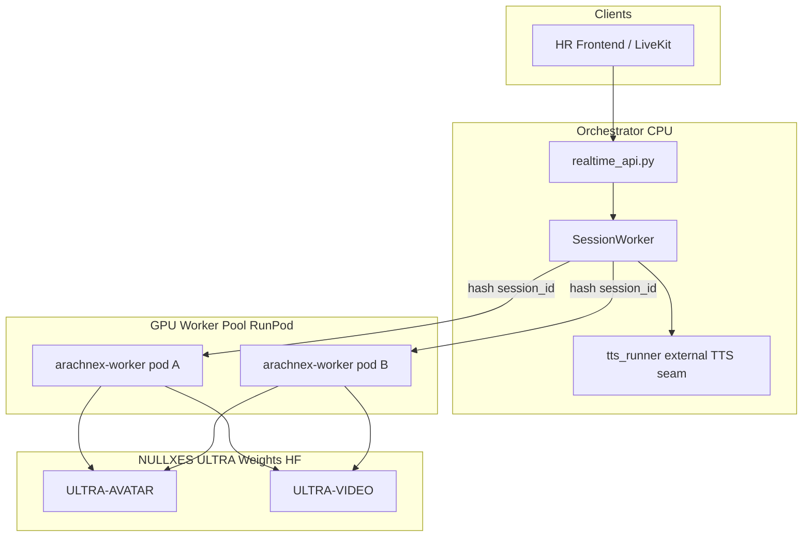

# ARACHNE-X Architecture (NULLXES)

**Document date:** 2026-05-27  
**Branch:** `arachne-last-patch`  
**Status:** Production-capable realtime avatar runtime (single-node + worker pool ready)

Operational doctrine for the ARACHNE-X stack: what trains, what infers, what is forbidden, and why.  
This document is **policy**. Code is enforced from this contract — not the other way around.


| Resource                      | Link                                                                                                           |
| ----------------------------- | -------------------------------------------------------------------------------------------------------------- |
| RunPod deployment (canonical) | `[Documentation/NULLXES_ARACHNE_RUNPOD_27-05-2026.md](Documentation/NULLXES_ARACHNE_RUNPOD_27-05-2026.md)`     |
| Dependencies (prod vs lab)    | `[Documentation/REQUIREMENTS.md](Documentation/REQUIREMENTS.md)`                                               |
| License                       | `[LICENSE](LICENSE)` — NULLXES Proprietary 2.0                                                                 |
| Classification guardrails     | `[Documentation/ARACHNE_X_CLASSIFICATION_2026-05-21.md](Documentation/ARACHNE_X_CLASSIFICATION_2026-05-21.md)` |
| Stability OS                  | `[Documentation/ARACHNE_STABILITY_OS_SPRINT2.md](Documentation/ARACHNE_STABILITY_OS_SPRINT2.md)`               |
| Iteration roadmap             | `[Documentation/ARACHNE_ITERATION_ROADMAP.md](Documentation/ARACHNE_ITERATION_ROADMAP.md)`                     |


**Support:** [ceo@nullxes.com](mailto:ceo@nullxes.com) | Telegram @MagistrTheOne

---

## Executive summary

ARACHNE-X ULTRA is NULLXES **realtime digital-human infrastructure**:

- **13.6B ACV-DiT** avatar transformer + Wan VAE + UMT5 + Wav2Vec2 audio conditioning
- **Chunked operational inference** (TTFF-first) with Stability OS (KV, identity drift, silence gate)
- **Explicit GPU worker queue** + orchestrator retry (no silent blocking on global locks)
- **Incremental wav2vec** — TTFF decoupled from total utterance length
- **Single canonical WebSocket path** — no shadow playback, no second orchestrator in `realtime_api.py`

Inference runs on **NULLXES proprietary pretrained weights** only. Public LongCat checkpoints are **not** the production weight source.

---

## Lineage:   NULLXES pretrained weights

### What LongCat was (historical context)

The first engineering generation of this stack followed the public **LongCat-Video** research line ([arXiv:2510.22200](https://arxiv.org/abs/2510.22200)):


| Aspect          | LongCat era (legacy reference)                                                                              |
| --------------- | ----------------------------------------------------------------------------------------------------------- |
| Public weights  | [meituan-longcat/LongCat-Video](https://huggingface.co/meituan-longcat/LongCat-Video), LongCat-Video-Avatar |
| Architecture    | 3D ACV-DiT ~13.6B, flow-match Euler, Wan VAE, UMT5, wav2vec2                                                |
| Role in NULLXES | **Architecture and tensor-layout reference only** — proved the DiT + audio-conditioned avatar path          |


Early NULLXES code imported LongCat class names and checkpoint layouts because the **tensor ABI** (block shapes, state dict keys, pipeline stages) matched that family.

### What NULLXES ships today (2026-05-27)


| Aspect              | NULLXES production                                                                                                                                                          |
| ------------------- | --------------------------------------------------------------------------------------------------------------------------------------------------------------------------- |
| **Runtime weights** | [ARACHNE-X-ULTRA-AVATAR](https://huggingface.co/MagistrTheOne/ARACHNE-X-ULTRA-AVATAR) · [ARACHNE-X-ULTRA-VIDEO](https://huggingface.co/MagistrTheOne/ARACHNE-X-ULTRA-VIDEO) |
| **Training**        | NULLXES-internal pretrain + LoRA on exported latents — **not** Meituan public checkpoints                                                                                   |
| **Code**            | `arachne_x/` — NULLXES implementation; pipeline class `ArachneXVideoAvatarPipeline`                                                                                         |
| **ABI names**       | `LongCatVideoAvatarTransformer3DModel`, `LongCatVideoTransformer3DModel` retained **only** so existing safetensors load without key remapping                               |
| **HTTP / routes**   | `/v1/arachne/`* — LongCat HTTP aliases (`/v1/longcat/generate`) **removed**                                                                                                 |


```text
BEFORE (research / bring-up):
  meituan-longcat weights  →  LongCat pipeline  →  demo scripts

NOW (production):
  NULLXES ULTRA weights    →  arachne_x.loader  →  infer.py / avatar_serving / worker
  LongCat names in code    =  checkpoint ABI only, not branding or weight source
```

**Policy:** Do not point `NULLXES_CHECKPOINT_DIR` at Meituan LongCat Hub repos in production. Do not re-introduce LongCat HTTP routes or a second DiT orchestration path.

---

## Weights & merged runtime layout

Two Hugging Face repos form the production tree:


| Repo                                                                                  | Role                                                  | Modes                                   |
| ------------------------------------------------------------------------------------- | ----------------------------------------------------- | --------------------------------------- |
| [ARACHNE-X-ULTRA-VIDEO](https://huggingface.co/MagistrTheOne/ARACHNE-X-ULTRA-VIDEO)   | tokenizer, VAE, scheduler, text_encoder, base DiT     | `t2v`, `i2v`, `vc`                      |
| [ARACHNE-X-ULTRA-AVATAR](https://huggingface.co/MagistrTheOne/ARACHNE-X-ULTRA-AVATAR) | avatar_single, avatar_multi, wav2vec, vocal_separator | `ai2v`, `at2v`, `avc`, `streaming_ai2v` |


**Merged avatar runtime** (`NULLXES_CHECKPOINT_DIR`, symlink bundle):

```text
checkpoint_dir/
  tokenizer/          ← ULTRA-VIDEO
  text_encoder/       ← ULTRA-VIDEO
  vae/                ← ULTRA-VIDEO
  scheduler/          ← ULTRA-VIDEO
  avatar_single/      ← ULTRA-AVATAR
  avatar_multi/       ← ULTRA-AVATAR
  audio/wav2vec2/     ← symlink to chinese-wav2vec2-base
  audio/vocal_separator/Kim_Vocal_2.onnx
```

Hub resolve (explicit opt-in only): `arachne_x.weights_resolve.resolve_weights_root(..., allow_hub=True)`.

Loader ownership: `arachne_x.loader.load_avatar_pipeline()` — **production avatar path**.  
Do not substitute `load_audio_i2v_pipeline()` (lab quarantine) for realtime serving.

---

## Layer model

```text
   ┌──────────────────────────────────────────────────────────────┐
   │              Behavior Layer (orchestrator, CPU)              │
   │  WebSocket gateway · SessionWorker · STT · LLM · TTS           │
   │  src/server/realtime_api.py · session_worker.py              │
   ├──────────────────────────────────────────────────────────────┤
   │              Realtime transport & routing                      │
   │  avatar_stream_client · avatar_worker_router · ws_events v1  │
   ├──────────────────────────────────────────────────────────────┤
   │              GPU worker (RunPod, dumb inference)             │
   │  services/arachnex-worker · streaming_queue · avatar_serving │
   ├──────────────────────────────────────────────────────────────┤
   │              Motion Adapter (future)                         │
   │  audio-driven motion residual on identity manifold           │
   ├──────────────────────────────────────────────────────────────┤
   │              Identity LoRA + identity bank (per persona)   │
   │  attention-only LoRA · enroll_identity · drift monitor       │
   ├──────────────────────────────────────────────────────────────┤
   │     Foundation DiT (frozen, NULLXES ULTRA pretrained)        │
   │  3D RoPE · flow-match · Wan VAE · UMT5 · wav2vec2           │
   │  class ABI: LongCatVideoAvatarTransformer3DModel             │
   └──────────────────────────────────────────────────────────────┘
```

**Process isolation (Wave 1 policy):**


| Process                        | Owns                                              | Must NOT own           |
| ------------------------------ | ------------------------------------------------- | ---------------------- |
| Orchestrator (`src/server/`*)  | WS, VAD, ASR, LLM, **TTS seam**, session state    | GPU DiT, model weights |
| GPU worker (`arachnex-worker`) | DiT inference, wav2vec, VAE decode, NDJSON egress | TTS, LLM               |
| CLI (`scripts/infer.py`)       | Offline/batch avatar + VIDEO modes                | —                      |


TTS in the GPU worker process causes VRAM contention and kills realtime stability. In-tree TTS (`arachne_x.tts` / `arachne_x.speech`) was removed; `src/server/tts_runner.py` is now an external-TTS seam (it raises until an external backend is wired, so the loop degrades to `text_only`). The CLI requires pre-rendered audio via `--audio`.

---

## Realtime orchestration (production — canonical)

**Single writer** for WebSocket egress. No shadow playback. No stub video loop in `realtime_api.py`.

```text
WebSocket chat.send / voice.pcm16
  → src/server/realtime_api.py          (gateway: auth, token mint, pump only)
  → src/server/session_worker.py        (SessionWorker — per-session owner)
  → src/server/realtime_avatar_loop.py  (LLM → TTS → frame stream)
  → src/server/avatar_stream_client.py  (PCM16 NDJSON POST + retry on worker_busy)
  → [avatar_worker_router hash(session_id) → worker URL]
  → services/arachnex-worker
      POST /v1/realtime/avatar_frames
      streaming_queue (admit → wait → active → release)
  → arachne_x/runtime/avatar_serving.py
      _gpu_inference_lock · generate_streaming_ai2v()
      IncrementalStreamingAudioEmb (partial wav2vec → chunk-0)
  → SessionWorker.out_queue
  → realtime_api pump
  → WS avatar.stream.chunk  (protocolVersion: v1)
```


| Component                 | Role                                                                  |
| ------------------------- | --------------------------------------------------------------------- |
| `realtime_api.py`         | WS gateway only — **not** a second orchestrator                       |
| `session_worker.py`       | VAD → ASR → LLM → TTS → GPU stream; `_process_lock` per session       |
| `realtime_avatar_loop.py` | Emits `avatar.stream.chunk` (not legacy `avatar.chunk`)               |
| `avatar_stream_client.py` | NDJSON client; retries `503 worker_busy` with `retryAfterMs` + jitter |
| `avatar_worker_router.py` | `NULLXES_AVATAR_WORKER_URLS` → `hash(session_id) % N`                 |
| `ws_events.py`            | Base payload includes `protocolVersion: "v1"`                         |
| `arachnex-worker`         | Dumb GPU: `imageBase64` + `audioPcm16Base64` → rgb24 NDJSON           |


**Removed (hardening cleanup, do not restore without design review):**

- Shadow playback / stub avatar paths in `realtime_api.py`
- `src/server/avatar_ws_frames.py`, `src/server/avatar_inference_client.py`
- HTTP `/v1/longcat/generate` and LongCat inference service key aliases
- TTS inside GPU worker process
- In-tree TTS backends `arachne_x/tts/` (Qwen + LongCat-AudioDiT) and `arachne_x/speech/` (edge-tts / espeak) — orchestrator now needs an external TTS
- Pseudo-phoneme conditioning in prod avatar path

STT → LLM → TTS → avatar schema: `[Documentation/ARACHNE_AVATAR_STT_LLM_TTS_SCHEMA.md](Documentation/ARACHNE_AVATAR_STT_LLM_TTS_SCHEMA.md)`.

---

## GPU worker: queue, heartbeat, observability (Wave 1)

Replaces implicit blocking on a global lock with **explicit admission control**.


| Env                                | Default | Effect                               |
| ---------------------------------- | ------- | ------------------------------------ |
| `ARACHNE_STREAM_MAX_ACTIVE_JOBS`   | `1`     | Concurrent NDJSON streams on one GPU |
| `ARACHNE_STREAM_MAX_QUEUE`         | `3`     | Waiting slots before reject          |
| `ARACHNE_STREAM_QUEUE_TIMEOUT_SEC` | `15`    | Max wait; then `503 queue_timeout`   |
| `ARACHNE_STREAM_ESTIMATED_JOB_MS`  | `8000`  | `retryAfterMs` hint in reject body   |


Overflow response:

```json
{
  "error": "worker_busy",
  "retryAfterMs": 8000,
  "queueDepth": 3,
  "estimatedWaitMs": 24000
}
```

Implementation: `services/arachnex-worker/streaming_queue.py` wraps `POST /v1/realtime/avatar_frames`.  
Inside inference: `avatar_serving._pipeline_load_lock` (singleton load) + `_gpu_inference_lock` (DiT execution).


| Endpoint                          | Role                                                               |
| --------------------------------- | ------------------------------------------------------------------ |
| `GET /health`                     | `lifecycle`, `gpuVisible`, `queueDepth`, `vramUsedMb`, `uptimeSec` |
| `GET /v1/runtime/metrics`         | Rejects, wait times, active jobs, MP4 queue depth                  |
| `POST /v1/admin/drain`            | Stop admitting new streams (auth key)                              |
| `POST /v1/admin/activate`         | Resume admitting streams                                           |
| `POST /v1/realtime/avatar_frames` | NDJSON RGB (PCM16 in)                                              |
| `POST /v1/arachne/generate`       | Sync MP4 (audio-image tasks)                                       |
| `POST /v1/infer/jobs`             | Async MP4 job queue (`INFERENCE_MAX_QUEUE`, default 32)            |


Multi-worker (orchestrator): `NULLXES_AVATAR_WORKER_URLS=url1,url2` — session affinity via SHA256 hash.  
Future: Redis `session_id → worker_id` (A6, RunPod deploy phase).

---

## Incremental wav2vec (TTFF architecture)

**Problem (pre-2026-05-27):** `generate_streaming_ai2v()` drained full audio → one `get_audio_embedding()` → TTFF ∝ utterance length.

**Fix:** `IncrementalStreamingAudioEmb` in `arachne_x/inference_audio.py`:

```text
audio_stream
  → partial wav2vec on ~400ms prefix (configurable)
  → chunk-0 denoise → first frames (TTFF)
  → full wav2vec on complete utterance
  → chunks 1..N
```


| Env                                  | Default                                   |
| ------------------------------------ | ----------------------------------------- |
| `ARACHNE_INCREMENTAL_WAV2VEC`        | `1` (on)                                  |
| `ARACHNE_INCREMENTAL_WAV2VEC_MIN_MS` | auto from `first_chunk_frames`            |
| `ARACHNE_LEGACY_STREAMING`           | `1` = rollback to monolithic denoise path |


Metrics in `RuntimeSamplingMetrics`: `wav2vec_partial_sec`, `wav2vec_full_sec`, `ttff_sec`.

Source of truth for streaming: `arachne_x/pipeline_arachne_x_video_avatar.py` → `generate_streaming_ai2v()`.  
**Not** `streaming_inference.py` (prototype scaffold — misleading name).

---

## Foundation DiT

Primary module: `arachne_x/modules/avatar/arachne_avatar_dit.py`  
Pipeline: `arachne_x/pipeline_arachne_x_video_avatar.py` → `ArachneXVideoAvatarPipeline`


| Field                 | Value                                                                       |
| --------------------- | --------------------------------------------------------------------------- |
| Checkpoint ABI class  | `LongCatVideoAvatarTransformer3DModel` *(historical name, NULLXES weights)* |
| Public pipeline class | `ArachneXVideoAvatarPipeline`                                               |
| Hidden size           | 4096                                                                        |
| Depth                 | 48                                                                          |
| Heads                 | 32                                                                          |
| Channels              | 16 / 16                                                                     |
| Patch size            | `(1, 2, 2)`                                                                 |
| Scheduler             | `FlowMatchEulerDiscreteScheduler` (shift 12)                                |
| VAE                   | `AutoencoderKLWan` (z_dim 16, temporal stride 4, spatial stride 8)          |
| Text                  | UMT5-XXL (4096 dim)                                                         |
| Audio                 | Wav2Vec2 (`audio/wav2vec2` in merged bundle)                                |


**Status:** frozen at train time. Base = **ARACHNE-X-ULTRA-AVATAR** snapshot.  
Identity adaptation = LoRA (attention-only) + identity bank.

Base VIDEO DiT: `arachne_x/modules/arachne_video_dit.py` — `LongCatVideoTransformer3DModel` (same ABI rule).

---

## Sampling OS & Stability OS

### Profiles


| Profile       | Steps | Distill | Chunks                         | Use case                        |
| ------------- | ----- | ------- | ------------------------------ | ------------------------------- |
| `operational` | 12    | yes     | F=33, overlap=8, first_chunk=9 | Worker realtime, TTFF           |
| `cinematic`   | 35    | no      | monolithic                     | Quality baseline, eval rollback |


Wiring: `arachne_x/runtime/sampling_profiles.py` → `execute_infer` / `avatar_serving`.


| Path           | Entry                                                                     |
| -------------- | ------------------------------------------------------------------------- |
| Chunked avatar | `generate_chunked_ai2v(yield_frames=True)`                                |
| Streaming      | `generate_streaming_ai2v()` → chunked unless `ARACHNE_LEGACY_STREAMING=1` |
| Stitch         | `arachne_x/runtime/chunk_stitch.py`                                       |


### Stability OS (active)

- Cross-chunk KV seed: `ARACHNE_CHUNK_KV=1`
- Identity drift monitor + corrective audio CFG scaling between chunks
- Silence gate on chunk boundaries
- Identity bank refresh policy per chunk

Details: `[Documentation/ARACHNE_STABILITY_OS_SPRINT2.md](Documentation/ARACHNE_STABILITY_OS_SPRINT2.md)`.

### Metrics (`RuntimeSamplingMetrics`)

Written to `<output>.run.json` and worker logs:


| Field                       | Meaning                       |
| --------------------------- | ----------------------------- |
| `ttff_sec`                  | Time to first frame emit      |
| `wav2vec_partial_sec`       | Prefix encode latency         |
| `wav2vec_full_sec`          | Full utterance encode latency |
| `dit_forwards`              | DiT forward pass count        |
| `denoise_wall_sec`          | Total denoise wall time       |
| `identity_cosine_per_chunk` | Drift monitor                 |
| `chunk_count`               | Chunks completed              |


---

## Identity LoRA

`scripts/train_lora_avatar.py` + `arachne_x/modules/lora_utils.py`.

**Scope (locked):** attention Q/K/V/Out only — enforced by `avatar_attention_only_lora_filter`.


| Module                                                         | LoRA?  |
| -------------------------------------------------------------- | ------ |
| `blocks.{N}.attn.qkv`, `.attn.proj`                            | YES    |
| `blocks.{N}.cross_attn.*`, `.audio_cross_attn.*`               | YES    |
| `blocks.{N}.ffn.*`, `audio_proj.*`, `final_layer.*`, embedders | **NO** |


Anti-snow: Min-SNR (γ=5), audio emb RMS norm, EMA 0.9995, BSA **off** during training.

---

## Prompt Intelligence Layer

`arachne_x/prompt_compiler/` — template merge before frozen UMT5.


| Backend | Shipped                                       |
| ------- | --------------------------------------------- |
| `off`   | Default — passthrough + avatar template merge |


Wiring: `inference_engine.apply_prompt_compiler` → `encode_prompt` → DiT.  
See `[Documentation/PROMPT_COMPILER.md](Documentation/PROMPT_COMPILER.md)`.

---

## Inference modes (`scripts/infer.py`)


| `--mode`                   | Weights       | Inputs                 | Output                           |
| -------------------------- | ------------- | ---------------------- | -------------------------------- |
| `**ai2v`**                 | merged avatar | image + audio + prompt | MP4 — **primary digitization**   |
| `**streaming_ai2v`**       | merged avatar | image + audio + prompt | MP4 / frames — **realtime path** |
| `**at2v`**                 | merged avatar | audio + prompt         | MP4                              |
| `**avc**`                  | merged avatar | video + audio + prompt | MP4 continuation                 |
| `**enroll_identity**`      | merged avatar | image + identity_id    | `.pt` bank                       |
| `**t2v**`                  | ULTRA-VIDEO   | prompt                 | MP4                              |
| `**i2v**`                  | ULTRA-VIDEO   | image + prompt         | MP4                              |
| `**vc**`                   | ULTRA-VIDEO   | video + prompt         | MP4                              |
| `audio_i2v`, `imagine_i2v` | lab adapter   | —                      | **Not prod avatar path**         |


Audio CFG (prod lipsync): **5.0–5.5** (`audio_guidance_scale`).

---

## Resolution & restoration policy

**Doctrine: resolution policy ≠ restoration policy.**

- **Avatar runtime is canonical 720p.** Modes `ai2v / at2v / avc / streaming_ai2v / enroll_identity` always run the 720p bucket. There is no 480p fallback: `avatar_serving.canonical_avatar_resolution()` coerces any request to `720p` (one-time warn), and `inference_engine` forces `720p` for avatar modes before `get_hw_for_resolution`, so API / log / UI never disagree with the bucket actually executed. The legacy `(480,832)` default sentinel is dead on the avatar path.
- **Foundation video (`t2v / i2v / vc / audio_i2v / imagine_i2v`) keeps 480p/720p.** Shared `bucket_config` (`ASPECT_RATIO_627*`) and latent caches stay until [RFC-002](Documentation/RFC-002-foundation-720p.md).
- **Restoration / upscale is a post-processing chain**, not a runtime mode. `arachne_x/runtime/frame_post_processing.py` provides `ProcessorRegistry` + `FrameProcessorChain` (ordered, per-frame, budget-bounded, graceful bypass). The chain runs *after* generation and knows nothing about the generator.
  - Opt-in via `NULLXES_FRAME_POSTFX` (e.g. `lanczos:1080`), budget via `NULLXES_FRAME_POSTFX_BUDGET_MS`. Empty by default → hot path pays nothing.
  - Built-in stages: `passthrough`, `lanczos` (dependency-light baseline). Heavy restorers attach via `REGISTRY.register` only when their backend is present (no shipped weights, no stubs).
  - Realtime tier: RealESRGAN-compact + TensorRT/FP16. MP4/offline tier: SeedVR2 (separate worker/queue/GPU pool, never in the realtime contour). FlashVSR tracked as a future streaming-VSR candidate.

---

## Training (continued pretrain / LoRA)

The runtime is inference-first, but the DiT is trainable from precomputed
flow-match latents. **No VAE / text encoder is needed at train time** — exported
samples already bake `latents` (noisy z_t), `noise` (eps target), `timesteps`,
and `prompt_embeds` / `prompt_mask`. This is why the foundation repo (DiT-only
safetensors) is trainable without the full runtime tree.


| Stage                | File                                       | Role                                                                  |
| -------------------- | ------------------------------------------ | --------------------------------------------------------------------- |
| Data + QC            | `scripts/prepare_foundation_train_pack.py` | OpenVid pull → QC filter → `manifest.json` + latents                  |
| Latent export        | `arachne_x/training_latent_export*.py`     | VAE-encode → normalize `z0` → flow-match `scale_noise` → `.pt` sample |
| Loss                 | `arachne_x/training_lora_loss.py`          | flow-match MSE(noise_pred, eps) + Min-SNR weighting                   |
| **Trainer (driver)** | `**scripts/train_arachne_dit.py`**         | the gradient loop: DiT + scheduler → optimizer steps                  |


Trainer targets `--model {foundation,base13b}` × `--mode {lora,full}`. LoRA is
attention-only (NULLXES policy, `lora_utils.avatar_attention_only_lora_filter`).
`full` uses **FSDP full-shard (bf16)** under `torchrun` for the 50B; single-GPU
for 13B smoke.

```bash
# 13B LoRA smoke — single H200
python scripts/train_arachne_dit.py --model base13b --mode lora \
    --latents_dir /workspace/datasets/arachne-foundation-smoke/latents \
    --out /workspace/runs/base13b-lora --micro_bsz 1 --grad_accum 8 --max_steps 500

# 50B foundation continued-pretrain — N GPUs, FSDP full-shard + activation checkpointing
torchrun --standalone --nproc_per_node=8 scripts/train_arachne_dit.py \
    --model foundation --mode full --grad_checkpointing \
    --latents_dir /workspace/datasets/arachne-foundation-smoke/latents \
    --out /workspace/runs/foundation-cpt --micro_bsz 1 --grad_accum 16 --max_steps 20000
```

`ARACHNE_FOUNDATION_CKPT` → 50B DiT dir; `NULLXES_CHECKPOINT_DIR` → 13B runtime
tree (`/dit`, `/scheduler`). The scheduler is loaded from the *same* config used
at export (`$NULLXES_CHECKPOINT_DIR/scheduler`) so Min-SNR timestep mapping stays
aligned. Each exported `.pt` bakes one timestep per clip — re-export with more t
for production-grade sigma coverage.

---

## Startup paths


| Path             | Entry                              | Notes                                                             |
| ---------------- | ---------------------------------- | ----------------------------------------------------------------- |
| **CLI**          | `scripts/infer.py`                 | Thin wrapper → `arachne_x.runtime.inference_engine.execute_infer` |
| **Library**      | `InferenceEngine`                  | Same contract as CLI                                              |
| **GPU worker**   | `services/arachnex-worker/main.py` | FastAPI → `gpu_avatar_runtime` → `avatar_serving` (lazy CUDA)     |
| **Orchestrator** | `src/server/`*                     | HTTP/WS client to worker; owns TTS                                |


### CLI example

```bash
export PYTHONPATH=/workspace/ARACHNE-X
export NULLXES_CHECKPOINT_DIR=/workspace/weights/arachne-avatar-runtime
export ARACHNE_RUNTIME_PROFILE=operational
export ARACHNE_INCREMENTAL_WAV2VEC=1

python scripts/infer.py \
  --checkpoint_dir "$NULLXES_CHECKPOINT_DIR" \
  --mode ai2v \
  --runtime_profile operational \
  --image ref.jpg --audio speech.wav \
  --prompt "speaking naturally to camera, stable identity"
```

### Worker example

```bash
export PYTHONPATH=/workspace/ARACHNE-X:/workspace/ARACHNE-X/services/arachnex-worker
export NULLXES_CHECKPOINT_DIR=/workspace/weights/arachne-avatar-runtime
export ARACHNE_RUNTIME_PROFILE=operational
export ARACHNE_INCREMENTAL_WAV2VEC=1
cd services/arachnex-worker
uvicorn main:app --host 0.0.0.0 --port 9090
```

Worker README: `[services/arachnex-worker/README.md](services/arachnex-worker/README.md)`.

---

## Environment reference (production)

### Weights & auth


| Variable                                            | Role                               |
| --------------------------------------------------- | ---------------------------------- |
| `NULLXES_CHECKPOINT_DIR` / `ARACHNE_CHECKPOINT_DIR` | Merged avatar bundle root          |
| `NULLXES_IDENTITY_BANK_PATH`                        | Identity bank `.pt` for worker/CLI |
| `NULLXES_INFERENCE_SERVICE_KEY`                     | Worker auth header                 |
| `HF_TOKEN`                                          | Hub download only — never commit   |


### Runtime / sampling


| Variable                      | Role                              |
| ----------------------------- | --------------------------------- |
| `ARACHNE_RUNTIME_PROFILE`     | `operational` | `cinematic`       |
| `ARACHNE_LEGACY_STREAMING`    | `1` = monolithic denoise rollback |
| `ARACHNE_CHUNK_KV`            | `1` = cross-chunk KV seed         |
| `ARACHNE_INCREMENTAL_WAV2VEC` | `1` = partial wav2vec TTFF path   |
| `ARACHNE_INFER_ENABLE_BSA`    | Infer-only block-sparse attention |


### Worker queue


| Variable                           | Default |
| ---------------------------------- | ------- |
| `ARACHNE_STREAM_MAX_ACTIVE_JOBS`   | `1`     |
| `ARACHNE_STREAM_MAX_QUEUE`         | `3`     |
| `ARACHNE_STREAM_QUEUE_TIMEOUT_SEC` | `15`    |


### Orchestrator routing


| Variable                             | Role                                        |
| ------------------------------------ | ------------------------------------------- |
| `NULLXES_AVATAR_INFERENCE_URL`       | Single worker base URL                      |
| `NULLXES_AVATAR_WORKER_URLS`         | Comma-separated pool                        |
| `NULLXES_AVATAR_INFERENCE_RETRY_MAX` | Client retries on `worker_busy` (default 3) |


---

## WebSocket contract (v1)

All events from `ws_events.ws_event_base()` include:

```json
{
  "protocolVersion": "v1",
  "at": 1710000000000,
  "sessionId": "...",
  "type": "avatar.stream.chunk"
}
```


| Event                       | Direction       | Notes                               |
| --------------------------- | --------------- | ----------------------------------- |
| `avatar.stream.chunk`       | server → client | RGB base64 frame + seq + tsMs       |
| `avatar.state.changed`      | server → client | `speaking` / `idle`                 |
| `session.error`             | server → client | Structured failure (no silent hang) |
| `chat.send` / `voice.pcm16` | client → server | Ingress to SessionWorker            |


Legacy `avatar.chunk` event name is **retired**.

---

## Policy table (binding)


| Feature                             | Train  | Infer          |
| ----------------------------------- | ------ | -------------- |
| BSA                                 | **NO** | Optional (env) |
| EMA                                 | YES    | N/A            |
| Min-SNR                             | YES    | N/A            |
| FFN / audio_proj / final_layer LoRA | **NO** | **NO**         |
| Attention-only LoRA                 | YES    | YES            |
| Meituan LongCat weights in prod     | **NO** | **NO**         |
| TTS in GPU worker                   | **NO** | **NO**         |
| Shadow WS playback                  | **NO** | **NO**         |


Enforcement: `avatar_attention_only_lora_filter`, `verify_lora_avatar.py`, `infer_attention.py` import guard.

---

## File map (production, 2026-05-27)

```text
arachne_x/                              # NULLXES runtime library
  loader.py                             # load_avatar_pipeline (prod)
  weights_resolve.py
  pipeline_arachne_x_video_avatar.py    # SOURCE OF TRUTH: generate_streaming_ai2v
  inference_audio.py                    # IncrementalStreamingAudioEmb, windowing
  inference_frames.py
  infer_attention.py
  runtime/
    avatar_serving.py                   # GPU singleton + _gpu_inference_lock
    inference_engine.py
    sampling_profiles.py
    sampling_metrics.py
  modules/avatar/arachne_avatar_dit.py  # LongCatVideoAvatarTransformer3DModel ABI

src/server/                             # Orchestrator (CPU)
  realtime_api.py                       # WS gateway + pump only
  session_worker.py                     # Per-session pipeline owner
  realtime_avatar_loop.py
  avatar_stream_client.py               # NDJSON client + retry
  avatar_worker_router.py               # Multi-worker hash routing
  ws_events.py                          # protocolVersion v1
  tts_runner.py                         # external TTS seam (in-tree TTS removed)

services/arachnex-worker/             # GPU HTTP worker
  main.py
  streaming_queue.py                    # Explicit admission queue
  gpu_avatar_runtime.py
  job_queue.py                          # Async MP4 jobs

scripts/
  infer.py                              # CLI entry
  train_lora_avatar.py
```

**Quarantine (not prod realtime):** `pipeline_audio_i2v.py`, `streaming_inference.py` (partial — see classification doc).

**Removed (hardening):** `model_adapter.py`, `config_realtime.py`, `avatar_ws_frames.py`, `avatar_inference_client.py`, phoneme aligner from prod path, LongCat HTTP routes, in-tree TTS (`arachne_x/tts/`, `arachne_x/speech/`).

---

## Deployment topology




RunPod step-by-step: `[Documentation/NULLXES_ARACHNE_RUNPOD_27-05-2026.md](Documentation/NULLXES_ARACHNE_RUNPOD_27-05-2026.md)`.

---

## Changelog (architecture milestones)


| Date                     | Milestone                                                                                                                   |
| ------------------------ | --------------------------------------------------------------------------------------------------------------------------- |
| Research baseline        | LongCat-Video ACV-DiT architecture reference (public Meituan weights)                                                       |
| NULLXES pretrain         | Proprietary ULTRA-VIDEO + ULTRA-AVATAR weights on HuggingFace                                                               |
| Sampling OS Sprint 1     | `operational` profile, chunked denoise, distill 12-step                                                                     |
| Stability OS Sprint 2    | KV cross-chunk, identity drift, silence gate                                                                                |
| **2026-05-27 hardening** | Single WS path, worker queue + reject, incremental wav2vec, multi-worker routing, WS v1 schema, LongCat HTTP sludge removed |


---

## Wave 1 hardening — implementation status (2026-05-27)

**Tier legend:** `low` = policy/scaffold only · `mid` = code complete, single-node · `high` = contract + tests + observability


| ID  | Deliverable                                                | Status | Tier     | Notes                                                        |
| --- | ---------------------------------------------------------- | ------ | -------- | ------------------------------------------------------------ |
| —   | Single WS orchestration path (no shadow playback)          | ✅      | **high** | `realtime_api` pump-only; LongCat HTTP sludge removed        |
| —   | Requirements audit (prod vs lab/training split)            | ✅      | **high** | `Documentation/REQUIREMENTS.md`, trimmed `requirements*.txt` |
| —   | RunPod deploy guide + LICENSE 2.0                          | ✅      | **high** | `NULLXES_ARACHNE_RUNPOD_27-05-2026.md`                       |
| S1  | Worker explicit queue + `503 worker_busy`                  | ✅      | **high** | `streaming_queue.py` · unit tests                            |
| S2  | Incremental wav2vec (TTFF decoupled from utterance length) | ✅      | **high** | `IncrementalStreamingAudioEmb` · unit tests                  |
| S3  | Multi-worker routing (`hash(session_id) % N`)              | ✅      | **mid**  | `avatar_worker_router.py` — no Redis yet (→ A6)              |
| S4  | Worker heartbeat / lifecycle (drain · activate)            | ✅      | **high** | `GET /health` · admin drain/activate                         |
| S5  | Runtime observability (TTFF · queue · VRAM metrics)        | ✅      | **mid**  | `/v1/runtime/metrics` · `.run.json` — pod smoke pending      |
| A8  | WS schema versioning (`protocolVersion: v1`)               | ✅      | **high** | `ws_events.py`                                               |
| A6  | Redis session affinity (`session_id → worker_id`)          | ⬜      | —        | Not started                                                  |
| A7  | GPU isolation guard (TTS/Qwen never in worker)             | ⬜      | **low**  | Policy enforced by layout; no runtime guard yet              |
| B9  | Incremental identity bank refresh between chunks           | ⬜      | —        | Roadmap                                                      |
| B10 | Adaptive scheduler under overload                          | ⬜      | —        | Roadmap                                                      |
| B11 | True duplex — interrupt · mid-cut · resume denoise         | ⬜      | —        | Roadmap                                                      |
| —   | RunPod Wave 1 smoke validation                             | ⬜      | —        | Checklist RunPod doc §5 — not run from Windows dev host      |


---

## Pending (RunPod deploy phase)


| Item                   | Scope                                                         |
| ---------------------- | ------------------------------------------------------------- |
| A6 Session affinity    | Redis `session_id → worker_id`                                |
| A7 GPU isolation guard | Runtime enforcement — TTS/Qwen never in worker process        |
| B9–B11                 | Identity refresh, adaptive scheduler, true duplex cut/resume  |
| Wave 1 smoke           | Queue reject, TTFF metrics, `/health`, NDJSON — RunPod doc §5 |


