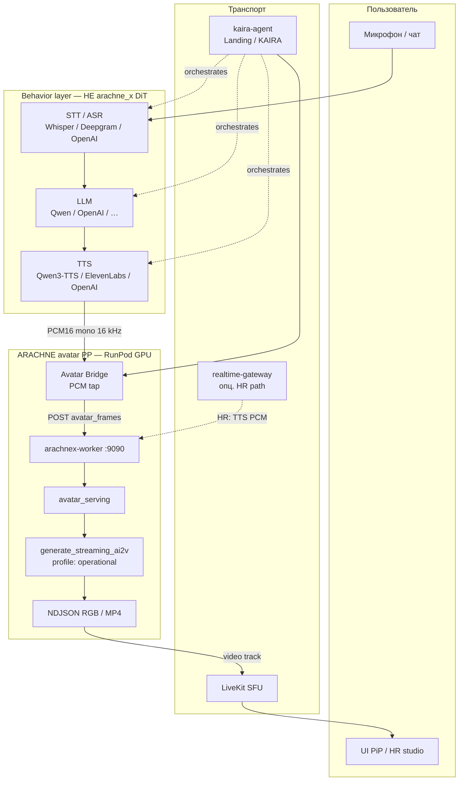
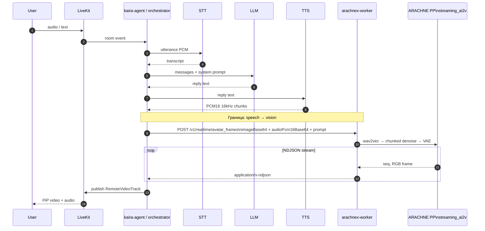
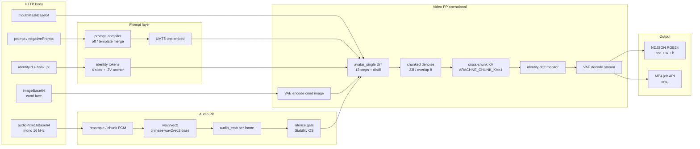
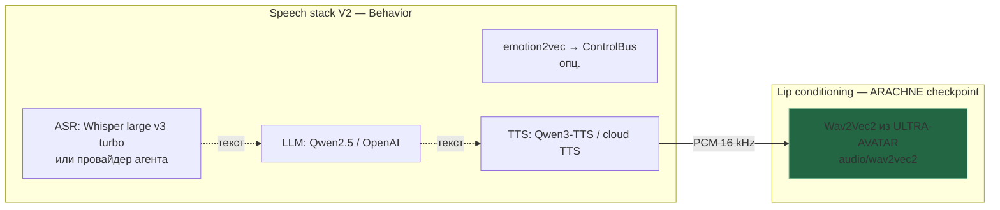

# ARACHNE-X — схема: STT → LLM → TTS → аватарный PP

Схематичное описание **продуктового пайплайна (PP)** говорящего аватара: где заканчивается речь (STT/LLM/TTS) и где начинается **ARACHNE avatar inference**.

| Термин | Значение |
| ------ | -------- |
| **PP (avatar)** | Production pipeline: PCM речи → Wav2Vec2 → chunked DiT denoise → VAE decode → кадры |
| **Behavior layer** | STT, LLM, TTS, LiveKit, gateway — **вне** `arachne_x` DiT |
| **Inference Worker** | `services/arachnex-worker` — единственный GPU-процесс DiT в проде |

Связанные документы: [`ARCHITECTURE.md`](../ARCHITECTURE.md), [`NULLXES_DEPLOYMENT_2026-05-25.md`](NULLXES_DEPLOYMENT_2026-05-25.md), [`ARACHNE_STABILITY_OS_SPRINT2.md`](ARACHNE_STABILITY_OS_SPRINT2.md).

---

## 1. Один взгляд: полный контур



**Граница ответственности:** ARACHNE-X **не** делает STT/LLM/TTS в realtime-проде. На вход PP приходит уже **готовое аудио реплики ассистента** (или микрофон в duplex-режиме — см. §4).

---

## 2. Последовательность одного turn (sequence)

Типичный turn ассистента (KAIRA / HR):



---

## 3. Внутри ARACHNE avatar PP (что делает GPU)

Вход воркера: **ref image** + **PCM** + **prompt** (+ опц. identity bank, mouth mask).



| Этап PP | Модуль / файл | Примечание |
| ------- | ------------- | ---------- |
| Загрузка весов | `arachne_x.loader.load_avatar_pipeline` | merged `arachne-avatar-runtime` |
| Профиль | `sampling_profiles.operational` | 12 steps, distill, chunk 33/8 |
| Стрим кадров | `pipeline.generate_streaming_ai2v` | default ≠ legacy monolithic |
| Serving | `runtime/avatar_serving.py` | singleton pipe, metrics → `.run.json` |
| HTTP | `services/arachnex-worker/main.py` | `runtimeProfile=operational` default |

---

## 4. Три продуктовых входа в avatar PP

```mermaid
flowchart TB
  subgraph paths [Кто подаёт PCM на воркер]
    P1[kaira-agent + bridge\nSTT→LLM→TTS→PCM]
    P2[realtime-gateway HR\nOpenAI Realtime TTS PCM]
    P3[src/server SessionWorker\ninternal orchestrator]
  end

  subgraph bypass [Без avatar PP]
    RTMP[RTMP path\nPCM→ffmpeg→LiveKit\nбез DiT]
  end

  P1 --> WK[arachnex-worker]
  P2 --> WK
  P3 --> WK

  style RTMP fill:#333,stroke:#888
  style WK fill:#1a4,stroke:#3c6
```



| Путь | STT | LLM | TTS | Avatar PP | Где в репо / монорепо |
| ---- | --- | --- | --- | --------- | --------------------- |
| **A. KAIRA / Landing** | agent (Deepgram / …) | agent | ElevenLabs / OpenAI | bridge → worker | `kaira-agent` (вне папки ARACHNE-X) |
| **B. HR gateway** | OpenAI Realtime | OpenAI Realtime | тот же поток PCM | `VIDEO_ENGINE=arachne*` → worker | `backend/realtime-gateway` |
| **C. Internal demo** | `src/server/asr_whisper` | `llm_runner` | `tts_runner` | `avatar_stream_client` → worker | `ARACHNE-X/src/server/` |
| **D. RTMP only** | — | — | OpenAI audio | **нет** DiT | interview / audio-bot |

**Duplex (микрофон → лицо без LLM):** `SessionWorker` может слать **mic PCM** напрямую в `stream_avatar_frames_from_audio` (lip-sync кандидата), STT только для транскрипта в UI.

---

## 5. STT / LLM / TTS — стек и владение



| Компонент | Prod (типично) | Владеет весами | В ARACHNE-X коде |
| --------- | -------------- | -------------- | ---------------- |
| STT | Deepgram / Whisper / OpenAI | внешний Hub / API | `src/server/asr_whisper.py` (demo) |
| LLM | OpenAI / Qwen | внешний | `src/server/llm_runner.py` (demo) |
| TTS | Qwen3-TTS / ElevenLabs | внешний + `requirements-tts.txt` | `arachne_x/tts/`, `tts_runner.py` |
| **Lip sync** | Wav2Vec2 checkpoint | **ULTRA-AVATAR** | `pipeline` + `loader` |

Офлайн CLI может синтезировать речь сам: `scripts/infer.py --speak_text` (TTS **внутри** infer, затем тот же Wav2Vec2 PP). Это **не** realtime prod path.

---

## 6. Контракт на границе TTS → avatar PP

| Поле HTTP | Тип | Роль |
| --------- | --- | ---- |
| `sessionId` | string | корреляция turn / room |
| `imageBase64` | JPEG/PNG | cond image (лицо) |
| `audioPcm16Base64` | bytes b64 | **речь ассистента**, mono 16 kHz |
| `prompt` | string | сцена + identity hints |
| `negativePrompt` | string | anti-artifacts |
| `runtimeProfile` | `operational` \| `cinematic` | sampling OS |
| `identityId` / `identityBankPath` | int / path | Stability OS identity |
| `mouthMaskBase64` | optional | hybrid mouth renderer |

Аудио-чанки upstream: **20–40 ms** PCM windows (MVP); воркер собирает поток и режет на micro-turn для `generate_streaming_ai2v`.

Env на поде: `NULLXES_CHECKPOINT_DIR`, `ARACHNE_RUNTIME_PROFILE=operational`, `ARACHNE_CHUNK_KV=1`, `NULLXES_IDENTITY_BANK_PATH`.

---

## 7. Слои NULLXES (где сидит PP)

```
┌─────────────────────────────────────────────────────────────┐
│  Behavior: STT → LLM → TTS → session memory → LiveKit      │  ← не пишет в DiT
├─────────────────────────────────────────────────────────────┤
│  Transport: gateway / kaira-agent / src/server HTTP client   │
├─────────────────────────────────────────────────────────────┤
│  ARACHNE avatar PP: worker → avatar_serving → streaming_ai2v │  ← этот документ
├─────────────────────────────────────────────────────────────┤
│  Identity LoRA + identity bank (per character)               │
├─────────────────────────────────────────────────────────────┤
│  Foundation DiT + VAE + UMT5 (frozen ULTRA-AVATAR)          │
└─────────────────────────────────────────────────────────────┘
```

---

## 8. Метрики PP (observability)

После прогона смотреть `<output>.run.json` → `sampling_metrics`:

| Метрика | Смысл |
| ------- | ----- |
| `ttff_sec` | time to first frame (realtime SLA) |
| `dit_forwards` | стоимость turn |
| `kv_cache_hits` | cross-chunk continuity |
| `identity_cosine_per_chunk` | drift Stability OS |
| `silence_ratio` | audio motion gate |

Bench: `scripts/gpu/eval_stability_bench.py` (operational vs cinematic).

---

*NULLXES · ARACHNE-X · схема STT–LLM–TTS → avatar PP · 2026-05*
