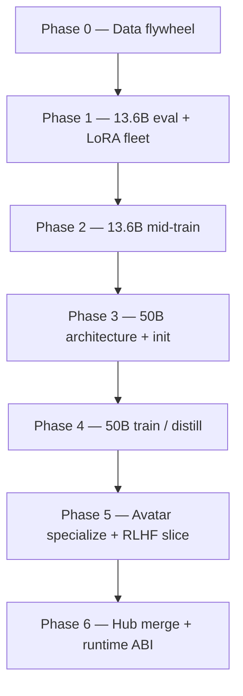

# NULLXES ARACHNE-X — Scale-Up Training Roadmap (13.6B → 50B)

| Field | Value |
|-------|-------|
| **Date** | 21.05.2026 |
| **Team** | NULLXES |
| **Scope** | ARACHNE-X codebase only — weights are **not** in git |
| **Production weights (Hub)** | [ARACHNE-X-ULTRA-AVATAR](https://huggingface.co/MagistrTheOne/ARACHNE-X-ULTRA-AVATAR) · [ARACHNE-X-ULTRA-VIDEO](https://huggingface.co/MagistrTheOne/ARACHNE-X-ULTRA-VIDEO) |
| **Baseline class** | See [`ARACHNE_X_CLASSIFICATION_2026-05-21.md`](ARACHNE_X_CLASSIFICATION_2026-05-21.md) |
| **GPU window** | **8× H100 80GB** + **4× H200 141GB** — dedicated for ~8 weeks |
| **Repo contents** | **Code + docs only** — no weight shards in git |

---

## Agent disclosure (this document author)

**Model:** **Auto** (Cursor agent router). Sub-agent label in logs: **Composer**.  
**Scope:** this monorepo path contains **ARACHNE-X source only** — no checkpoint install, no local `weights/` in git. All production shards live on Hub:

- [MagistrTheOne/ARACHNE-X-ULTRA-AVATAR](https://huggingface.co/MagistrTheOne/ARACHNE-X-ULTRA-AVATAR)
- [MagistrTheOne/ARACHNE-X-ULTRA-VIDEO](https://huggingface.co/MagistrTheOne/ARACHNE-X-ULTRA-VIDEO)

Training and infer run on **RunPod (or equivalent) GPU pools** — not on the developer laptop.

---

## Compute badges (operational, not in repo)

Weights are pulled on-pod from Hub. Typical NULLXES fleet layouts referenced in runbooks:

| Badge | Role |
|-------|------|
| **1× H200** | Single-avatar `ai2v` / `enroll_identity` / LoRA smoke / latent export |
| **4× H200** | Parallel export farm, teacher forward cache, eval consolidation |
| **8× H100** | Data-parallel mid-train, distill student steps, WebDataset throughput |

**Scale-up window (this roadmap):** **8× H100 + 4× H200** treated as one coordinated cluster (~12 GPUs) for ~8 weeks.

---

## 1. Executive summary

**Goal:** evolve NULLXES production line from **ARACHNE-X ULTRA · ACV-DiT-13.6B** (frozen foundation today) to a **~50B-parameter** tier suitable for higher-fidelity digital employees, longer coherent motion, and tighter audio–video coupling — without breaking the operational runtime (`ai2v`, identity bank, merged avatar runtime).

**Idea in one sentence:** treat **13.6B as the teacher and production anchor**, build a **proprietary latent data flywheel** on the existing export/train stack, then scale via **MoE-first 50B** (≈14–18B active per step) rather than a naive dense 50B full pretrain in eight weeks.

**Realism:** with **12 high-end GPUs for ~2 months**, you can **fully industrialize data + 13.6B mid-training + character LoRA fleet + 50B architecture bring-up and distillation pilots**. A **from-scratch 50B pretrain to production quality** typically requires **6–12+ GPU-months** at this class; the roadmap below sequences what **is** achievable in the window vs what **extends** beyond it.

---

## 2. Naming taxonomy (English, NULLXES product line)

| Stage | Public name | Slug | Active params | Total params |
|-------|-------------|------|---------------|--------------|
| **Today (Hub)** | NULLXES ARACHNE-X ULTRA · ACV-DiT-13.6B | `arachne-x-ultra-acv-dit-13.6b-d4096-l48` | **13.6B** | 13.6B dense |
| **Target (recommended)** | NULLXES ARACHNE-X ULTRA · ACV-DiT-50B-MoE | `arachne-x-ultra-acv-dit-50b-moe-a16b` | **~14–18B** | **~50B** |
| **Alternative (high risk)** | NULLXES ARACHNE-X ULTRA · ACV-DiT-50B-Dense | `arachne-x-ultra-acv-dit-50b-d7168-l48` | **50B** | 50B dense |

**Why MoE is the default recommendation**

| Criterion | 50B MoE (top-2) | 50B dense |
|-----------|-----------------|-----------|
| Fits 4× H200 inference | Yes (active ~16B) | Marginal / multi-GPU only |
| Training cost vs quality | Teacher distill + mid-train | Full pretrain ≈ 4× 13.6B step cost |
| Avatar lipsync (audio cross-attn) | Same block pattern, expert routing | Same, but memory-bound |
| NULLXES ops at 3AM | Active params observable | OOM risk on single H200 |
| Industry precedent | Wan-class MoE lines on HF cards | Rare at 50B for realtime avatar |

Hub publication (future): keep **VIDEO** and **AVATAR** cards; add tags `50b`, `moe`, `v3-scale` when weights pass eval gates in [`GTM_DATA_EVAL.md`](DOC_CHECK/GTM_DATA_EVAL.md).

---

## 3. What exists in-repo today (training surface)

This repo ships **code and contracts**, not shards. Training is **latent-first**:

```
Raw video+audio  →  VAE encode + UMT5 + wav2vec (export)  →  .pt / WebDataset shards
                                                              →  scripts/train.py (VIDEO DiT)
                                                              →  scripts/train_lora_avatar.py (avatar LoRA)
```

| Asset | Path | Role |
|-------|------|------|
| Latent sample contract | `arachne_x/training_latent_common.py` | `validate_latent_sample` |
| Avatar latent export | `arachne_x/training_latent_export.py` | paired image+audio+prompt |
| Base latent export | `arachne_x/training_latent_export_base.py` | VIDEO modes |
| WebDataset loader | `arachne_x/training_wds.py` | `LatentWebDataset` |
| Full DiT train (minimal) | `scripts/train.py` | frozen VAE latents, flow-match loss |
| Avatar LoRA train | `scripts/train_lora_avatar.py` | **attention-only** LoRA policy |
| H200 reference config | `arachne_x/training_config_h200.py` | aspirational; wire gradually |
| Eval gates | `Documentation/DOC_CHECK/GTM_DATA_EVAL.md` | E-LIPS, E-ID, E-TEMP, merge policy |
| Dataset fetch | `scripts/fetch_hf_datasets.py`, `data/datasets/README.md` | OpenHumanVid, HD-VILA, Tiger preview |

**Binding policy:** [`ARCHITECTURE.md`](../ARCHITECTURE.md) — no FFN / `audio_proj` LoRA; BSA off during train; Min-SNR + audio RMS norm on avatar LoRA.

---

## 4. Strategic plan — six phases



### Phase 0 — Data flywheel (weeks 1–2)

**Objective:** reproducible **latent shards** for VIDEO and AVATAR paths; legal + quality gates before GPU burn.

| Workstream | Deliverable |
|------------|-------------|
| Ingest | Curated **talking-head** + **general motion** + **continuation** clips |
| Filters | blur, exposure, face box, SNR, shot cuts, consent metadata |
| Captions | ASR → prompt; HR templates (`speaking`, `lipsync`, `stable identity`) |
| Export | `scripts/export_latent_training_sample.py` → shard packer → `train.py --wds_shards` |
| Versioning | `latents_v1/` immutable; VAE change → `latents_v2/` per `GTM_VAE_ABI.md` |

**GPU use:** mostly **CPU + 1× H200** for export throughput; parallelize export jobs across 4× H200.

---

### Phase 1 — Consolidate 13.6B production (weeks 2–3)

**Objective:** baseline **teacher** checkpoint + per-character LoRA library before any 50B spend.

| Task | Tooling | Output |
|------|---------|--------|
| Nightly eval | `GTM_DATA_EVAL.md` manifest | `eval_report.json` vs baseline |
| HR characters | `train_lora_avatar.py` | rank 128 LoRA, keys per employee |
| Identity | `enroll_identity` + bank | `.pt` banks aligned with LoRA |
| Smoke | `scripts/infer.py` ai2v sync | pass E-LIPS / E-ID gates |

**Checkpoint:** keep [ARACHNE-X-ULTRA-AVATAR](https://huggingface.co/MagistrTheOne/ARACHNE-X-ULTRA-AVATAR) as **teacher**; tag commit hash in `eval_baseline.json`.

---

### Phase 2 — 13.6B mid-train on proprietary latents (weeks 3–5)

**Objective:** move **13.6B** — not yet 50B — on NULLXES corpus (flow-match continuation, better long-horizon stability per VIDEO card claims).

| Mode | Script | Data mix (target) |
|------|--------|-------------------|
| VIDEO continuation | `scripts/train.py` (VIDEO DiT) | general + long clips |
| Avatar audio-video | `scripts/train.py` (avatar DiT) or staged full FT | **≥70% talking-head** |

**Training knobs (in-repo today):** latent batches, Min-SNR (`training_lora_loss.py`), gradient checkpointing on DiT, **dense attention only** (BSA disabled).

**Realistic scale for 3 weeks on 8× H100:** **2–8M latent samples** (depends on T×H×W per clip); prioritize **720p, 49–97 frames** clips for avatar; longer 165+ for VIDEO continuation subset.

**Exit gate:** E-TEMP, E-T2V/I2V proxies not below Hub 13.6B baseline; publish as `ARACHNE-X-ULTRA-VIDEO-v1.1` / `AVATAR-v1.1` only if gates pass.

---

### Phase 3 — 50B architecture definition + weight init (weeks 4–6)

**Objective:** frozen **design** + initialized weights; **no** production merge yet.

| Decision | Recommended |
|----------|-------------|
| Topology | **MoE** in FFN blocks (e.g. 16 experts, top-2), keep **d4096, L48** or **d5120, L56** |
| Active params | ~14–18B |
| Total params | ~50B |
| Audio / identity | **Same** cross-attn pattern as `arachne_avatar_dit.py` — ABI-stable |
| Init | **Expand + distill from 13.6B teacher** (not random init) |

**Code work (repo):** extend `arachne_x/modules/avatar/arachne_avatar_dit.py` + VIDEO twin; add `MoELayer` behind config flag; loader split for expert shards.

**GPU:** 4× H200 — forward parity tests vs teacher on 100 fixed latents (MSE on noise prediction).

---

### Phase 4 — 50B train / distillation (weeks 6–8, extends beyond 2 months for full convergence)

**Objective:** first **converged** 50B-MoE checkpoint.

| Track | Description | 2-month feasibility |
|-------|-------------|---------------------|
| **4A — Distill (recommended)** | Teacher 13.6B → student 50B-MoE on same latent shards | **Feasible** — main GPU burn |
| **4B — Continued pretrain** | Long-run MoE on mixed corpus | **Partial** — needs schedule extension |
| **4C — Dense 50B** | Full-width pretrain | **Not recommended** in window |

**Loss stack:** flow-match (primary) + optional feature align to teacher hidden states (distill) + avatar aux (`training_avatar_aux.py`) in Phase B only when stable.

**Distributed layout (12 GPUs):**

| Pool | Role |
|------|------|
| **8× H100** | Data-parallel mid-train / distill steps (avatar + VIDEO shards) |
| **4× H200** | Large-batch teacher forward, export, eval, checkpoint consolidation |

---

### Phase 5 — Avatar specialization + RLHF slice (post–50B core)

**Objective:** HR-grade lipsync and identity on **50B-MoE** student.

| Layer | Mechanism |
|-------|-----------|
| Identity | identity bank + `enroll_identity` (unchanged API) |
| Per-character | attention-only LoRA on **50B** student (same policy) |
| RLHF / GRPO | Multi-reward fine-tune (VIDEO card cites GRPO) — **new script**; lip-sync + identity + temporal rewards |

**Data:** 500–2k **paired** HR clips per character (Elena-class: `assets/avatar/single/*/lora_pairs.json` pattern at scale).

---

### Phase 6 — Production merge + Hub (release gate)

| Artifact | Hub repo |
|----------|----------|
| VIDEO 50B-MoE | [ARACHNE-X-ULTRA-VIDEO](https://huggingface.co/MagistrTheOne/ARACHNE-X-ULTRA-VIDEO) |
| AVATAR 50B-MoE | [ARACHNE-X-ULTRA-AVATAR](https://huggingface.co/MagistrTheOne/ARACHNE-X-ULTRA-AVATAR) |
| Merged runtime | `weights/arachne-avatar-runtime` symlinks (RunPod layout) |

**Runtime ABI:** `scripts/infer.py` modes unchanged; `NULLXES_CHECKPOINT_DIR` points to new bundle; eval matrix in `GTM_DATA_EVAL.md` §6.

---

## 5. Data requirements (what to collect, by phase)

### 5.1 Tier definitions

| Tier | Content | Primary use |
|------|---------|-------------|
| **A — HR talking-head** | Single speaker, 720p+, clean audio, 3–30 s clips | Avatar LoRA, ai2v, E-LIPS |
| **B — Multi-speaker meeting** | 2–4 faces, diarized audio | Multitalk, mask routing |
| **C — General video** | Scene motion, camera move, no face | VIDEO t2v/i2v/vc |
| **D — Long continuation** | 30 s–5 min, stable scene | AVC, temporal memory |
| **E — Hard negatives** | blur, occlusions, profile, low light | robustness filters |

### 5.2 Volume targets (realistic NULLXES 8-week program)

| Phase | Tier A hours | Tier B hours | Tier C hours | Tier D hours | Latent shards (order of magnitude) |
|-------|--------------|--------------|--------------|--------------|-------------------------------------|
| **0–1** (bootstrap) | **200–500** | 50 | 500 | 50 | **5–15 TB** export buffer |
| **2** (13.6B mid-train) | **1,000–2,000** | 200 | **2,000–5,000** | **200–500** | **30–80 TB** WDS |
| **4** (50B distill) | reuse + **+500** | +100 | +1,000 | +200 | +20 TB net new |
| **5** (per character LoRA) | **20–50 pairs × N chars** | — | — | — | **0.1–1 TB** |

**Clip yield after filters:** assume **40–60%** retention from raw download → plan **2× raw ingest** vs targets above.

**Public ingest starters (repo already wired):** OpenHumanVid, HD-VILA subset, Tiger preview — [`data/datasets/README.md`](../data/datasets/README.md). Production HR corpus should be **proprietary + consented**; public sets are for pipeline shakeout only.

### 5.3 Per-sample tensor contract (export)

Required keys per `training_latent_common.validate_latent_sample`:

| Key | Avatar | VIDEO |
|-----|--------|-------|
| `latents` | ✓ | ✓ |
| `prompt_embeds` | ✓ | ✓ |
| `prompt_mask` | ✓ | ✓ |
| `timesteps` | ✓ | ✓ |
| `noise` | ✓ | ✓ |
| `audio_embs` | **✓** | — |

Export uses frozen **UMT5 + Wan VAE + wav2vec** from Hub checkpoints — same as inference parity.

---

## 6. GPU allocation matrix (8× H100 + 4× H200)

Assumes **NCCL** cluster or 2 RunPod pools bridged VPN; if isolated pods, prioritize **self-contained 4× H200** avatar export + distill.

| Week | H100 ×8 | H200 ×4 |
|------|---------|---------|
| 1–2 | Dataset QC, small `train_lora` | **Latent export farm** (parallel `export_latent_*`) |
| 3–4 | 13.6B VIDEO mid-train | Avatar LoRA + teacher forwards |
| 5–6 | 13.6B AVATAR mid-train | Eval nightly + identity enroll regression |
| 7–8 | **50B distill** student steps | Teacher cache + checkpoint merge |
| Overflow | GRPO pilot (if distill stable) | Full-frame eval ai2v duration |

**Memory planning (order of magnitude):**

| Job | Per-GPU VRAM |
|-----|----------------|
| 13.6B train + grad checkpoint | ~60–80 GB |
| 13.6B teacher forward (no grad) | ~40–55 GB |
| 50B-MoE active ~16B train | ~70–90 GB |
| 50B-MoE infer (production target) | **~90–120 GB** → **H200-class** |

---

## 7. Why this plan is realistic (and what is not)

### Achievable in ~8 weeks with 12 GPUs

- Industrial **latent flywheel** and versioning.
- **13.6B mid-train** on NULLXES mix with automated eval gates.
- **Character LoRA fleet** (Elena, Svetlana, N employees) on frozen or v1.1 base.
- **50B-MoE** architecture coded, initialized, **distillation pilot** with measurable E-LIPS / E-ID lift vs teacher.
- Hub **v1.1** tags for improved 13.6B (low risk).

### Not achievable without extending timeline or fleet

- **Dense 50B** full pretrain to exceed 13.6B on all VIDEO+AVATAR metrics.
- **50B production merge** that beats teacher on **long-form duration mode** without segment orchestration layer.
- **Realtime <33 ms/frame** at 50B on single GPU without distill-to-active-16B + kernel work (`streaming_inference.py` still batch-diffusion centric).

### Justification (NULLXES doctrine)

1. **Infrastructure first:** data + eval gates before parameter count marketing.
2. **Teacher–student reduces risk:** 13.6B Job.ai bring-up (21.05.2026) proves runtime; 50B must not break `ai2v` / identity bank ABI.
3. **MoE matches ops:** 4× H200 fleet maps to **active** compute, not total parameter count.
4. **Latent training is the moat:** export parity with `inference_engine` wins over raw-pixel end-to-end spend.

---

## 8. Milestones and kill criteria

| Milestone | Week | Pass criteria |
|-----------|------|---------------|
| M0 | 2 | ≥10k validated latent samples; export CI green |
| M1 | 3 | LoRA fleet + identity banks; E-LIPS ≥ baseline |
| M2 | 5 | 13.6B v1.1 mid-train: E-TEMP, E-ID not regressed |
| M3 | 6 | 50B-MoE forward parity <1% noise MSE vs teacher on holdout |
| M4 | 8 | 50B-MoE distill: E-LIPS **+3%** rel. or E-ID **+2%** vs 13.6B teacher |
| M5 | 10+ | Hub publish `50b-moe` after E-MOS panel (release gate) |

**Kill / pivot triggers:**

- E-ID drop **>5%** after mid-train → rollback shard mix (too much Tier C in avatar path).
- 50B active VRAM **>120 GB** at 720p 97 frames → reduce experts or keep 13.6B as production, 50B as offline cinematic tier only.
- VAE ABI change without `latents_v2/` → **stop train**, re-export (hard gate in `GTM_VAE_ABI.md`).

---

## 9. Immediate next actions (codebase-ready)

```bash
# 0) Hub weights on pod only (not in git)
export ARACHNE_AVATAR_CKPT=MagistrTheOne/ARACHNE-X-ULTRA-AVATAR
export ARACHNE_VIDEO_CKPT=MagistrTheOne/ARACHNE-X-ULTRA-VIDEO

# 1) Fetch open corpora for pipeline test
pip install -r requirements-datasets.txt
python scripts/fetch_hf_datasets.py --openhumanvid --openhumanvid-max-rows 50000

# 2) Export one Elena-class sample (parity check)
python scripts/export_latent_training_sample.py \
  --checkpoint_dir "$NULLXES_CHECKPOINT_DIR" \
  --image assets/avatar/single/elena/image.jpg \
  --audio assets/avatar/single/elena/audio.wav \
  --prompt "ELENA, speaking naturally, precise lipsync, stable identity."

# 3) LoRA smoke (1× H200)
python scripts/train_lora_avatar.py \
  --checkpoint_dir "$NULLXES_CHECKPOINT_DIR" \
  --dataset_dir ./latents/elena_smoke \
  --output_dir ./lora/elena_hr \
  --max_steps 500
```

---

## 10. Related documents

| Doc | Role |
|-----|------|
| [`ARACHNE_X_CLASSIFICATION_2026-05-21.md`](ARACHNE_X_CLASSIFICATION_2026-05-21.md) | Model class, dims, modes |
| [`JOB_AI_AVATAR_RUNBOOK_2026-05-21.md`](JOB_AI_AVATAR_RUNBOOK_2026-05-21.md) | RunPod infer bring-up |
| [`ARCHITECTURE.md`](../ARCHITECTURE.md) | Train/infer policy |
| [`DOC_CHECK/GTM_DATA_EVAL.md`](DOC_CHECK/GTM_DATA_EVAL.md) | Eval gates |
| [`DOC_CHECK/GTM_PRODUCTION_CONTRACT.md`](DOC_CHECK/GTM_PRODUCTION_CONTRACT.md) | Runtime + train engine layout |
| [ARACHNE-X-ULTRA-VIDEO](https://huggingface.co/MagistrTheOne/ARACHNE-X-ULTRA-VIDEO) | 13.6B VIDEO weights |
| [ARACHNE-X-ULTRA-AVATAR](https://huggingface.co/MagistrTheOne/ARACHNE-X-ULTRA-AVATAR) | 13.6B AVATAR weights |

---

## 11. One-page plan (English)

| # | Phase | Weeks | GPUs | Outcome |
|---|-------|-------|------|---------|
| 0 | Data flywheel | 1–2 | 4× H200 export | WDS latent shards, legal/QC |
| 1 | 13.6B teacher + LoRA fleet | 2–3 | 1–4× H200 | HR characters on Hub 13.6B |
| 2 | 13.6B mid-train | 3–5 | 8× H100 | v1.1 VIDEO/AVATAR if eval gates pass |
| 3 | 50B-MoE architecture | 4–6 | 4× H200 | Init from teacher, ABI parity |
| 4 | 50B distill | 6–8+ | 8× H100 + 4× H200 | First converged `50b-moe` pilot |
| 5 | Avatar specialize + GRPO slice | 8–10+ | H200 infer eval | LoRA on student, lipsync lift |
| 6 | Hub merge | gate | — | Publish when E-LIPS/E-ID beat teacher |

**Idea:** data moat + teacher anchor + MoE scale — not blind 50B pretrain.  
**Realism:** 8 weeks → strong **13.6B v1.1** + **50B pilot**; production **50B** merge is week 10+ with eval panel.

---

**NULLXES** · ARACHNE-X scale-up roadmap · 21.05.2026 · *Auto (Cursor)*
