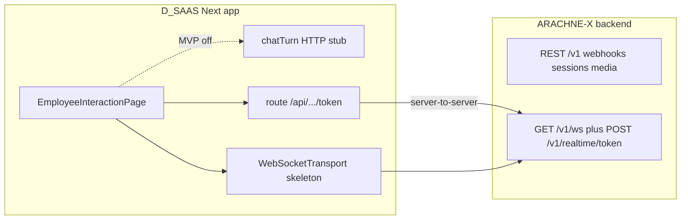

# ARACHNE-X ↔ D_SAAS (dashboard): контракт интеграции

**Сторона:** NULLXES  
**Аудитория:** прежде всего **команда фронта D_SAAS** (`dai_saas`, Next.js) и бэкенд ARACHNE-X; этот текст — точка согласования «что ждём на проводе», без привязки к документам JobAI.

**Папка документа:** [`Documentation/D_SAAS/`](./README.md) — только dashboard / D_SAAS. Материалы **JobAI pilot** — отдельно в [`Documentation/JOBAI PILOT/`](../JOBAI%20PILOT/).

**Назначение:** единая спека для стыковки **ARACHNE-X backend** (репозиторий ARACHNE-X) и **фронта D_SAAS** (`dai_saas`).  
**Источник типов на фронте:** `features/arachine-x/event-system/eventTypes.ts` (имя пакета с опечаткой `arachine-x`; переименование — отдельная задача).  
**Статус:** REST-оркестрация MVP реализована в ARACHNE-X; **линия B (дашборд):** `POST /v1/realtime/token`, `GET /v1/ws` (WebSocket), опционально `POST /v1/chat` — реализованы в `src/server` как **MVP-провод** (opaque token, in-memory store; см. [WIRE_EXAMPLES.md](./WIRE_EXAMPLES.md)). Поведение чата/LLM на проводе может быть заглушкой до подключения реального пайплайна.

**Сопутствующие артефакты (репозиторий ARACHNE-X, не в `dai_saas`):** OpenAPI `GET /v1/openapi.json`, документ [NULLXES MVP Media Layer API](../JOBAI%20PILOT/NULLXES_MVP_Media_Layer_API_03-04-2026.md) (оркестрация слотов / webhook для **внешнего** platform-backend), [`src/server/openapi_spec.py`](../../src/server/openapi_spec.py).

---

## 1. Две линии (не смешивать)

| Линия | Назначение | Где на фронте (ориентир) | Где на бэке (ARACHNE-X) |
|--------|------------|---------------------------|-------------------------|
| **A. Оркестрация сессий** | Webhook и lifecycle для **внешнего platform-backend** (HR / интервью / слоты); **не** то же самое, что открытие страницы сотрудника в dashboard | Обычно **не** в UI; вызывается сервером платформы | Реализовано: `POST /v1/webhooks/session`, `/v1/sessions/...`, `/v1/media/slots` — см. [MVP Media Layer API](../JOBAI%20PILOT/NULLXES_MVP_Media_Layer_API_03-04-2026.md), `GET /v1/openapi.json` |
| **B. Dashboard realtime** | Токен, WebSocket, сигналы сессии/аватара/чата в браузере | `useAvatarRuntime`, `WebSocketTransport`, bootstrap сотрудника | **Реализовано (MVP провод):** `POST /v1/realtime/token`, `GET /v1/ws`; см. §3b, [WIRE_EXAMPLES.md](./WIRE_EXAMPLES.md) |

### 1.1 Решение продукта для MVP D_SAAS (зафиксировано)

- **Канал чата для MVP:** **основной — WebSocket** (`chat.send` / `chat.message.received`). Дублирующий UI-поток через HTTP не требуется; заглушка `chatTurn.ts` в `dai_saas` для MVP **не подключаем** к REST, пока продукт явно не запросит второй канал.
- **REST-чат `POST /v1/chat`:** остаётся **опциональным** (для стендов, Bruno, будущего SSE); не использовать параллельно с WS в одном экране без согласования.

**Модель `sessionId` для dashboard (линия B):**

- Поле **`sessionId`** в теле `POST /v1/realtime/token` и в теле опционального `POST /v1/chat` — это **идентификатор сессии интерфейса дашборда**, который знает платформа/Next (`getEmployeeSessionBootstrap`). Он **не обязан** совпадать с `nullxes_session_id` линии A.
- Если платформа **уже** создала оркестраторскую сессию через webhook (линия A), в токен/метаданные можно передавать **`nullxesSessionId`** отдельно (опциональное поле в теле mint-токена), чтобы бэкенд связал UI-сессию с воркером; если линия A не вызывалась, линия B работает автономно с одним `sessionId` (предпросмотр / тест).
- **Итог для фронта:** в bootstrap и в чате использовать **один** основной `sessionId` (UI); `nullxesSessionId` — только если platform-backend его отдаёт после webhook.



---

## 2. Environments

| Окружение | Переменная / значение | Примечание |
|-----------|------------------------|------------|
| Dev | `NEXT_PUBLIC_ARACHNE_HTTP_BASE` (пример) | База HTTP API оркестратора (если фронт бьёт напрямую) |
| Dev | `NEXT_PUBLIC_ARACHNE_WS_URL` (пример) | Origin WebSocket **когда** сервер будет готов |
| Stage / Prod | Те же, с прод-оригинами | Рекомендуется **Next rewrite/proxy**: браузер бьёт в same-origin `/api/arachne/...` → upstream ARACHNE |

Плейсхолдеры имён env — согласовать в репозитории **`dai_saas`**; итоговые имена и значения зафиксировать в **`.env.example` того репозитория** (в дереве ARACHNE-X фронта нет — ссылку на файл здесь не дублируем).

---

## 3. HTTP: выдача сессии и токена (совместимость с фронтом)

Фронт ожидает форму ответа в духе (заглушка `issueAvatarTokenClaims` / route token):

```json
{
  "token": "<string>",
  "websocketUrl": "wss://example.com/v1/realtime",
  "issuedAt": "2026-04-03T12:00:00.000Z",
  "expiresAt": "2026-04-03T12:15:00.000Z"
}
```

**Формат времени (истина для ARACHNE-X MVP):** в ответе **`issuedAt` и `expiresAt` — строки ISO-8601 с суффиксом `Z`** (как в примере выше). На границе Next (`/api/arachine-x/token`) при необходимости **нормализовать** к числам Unix ms для текущего UI-кода `dai_saas`.

**Рекомендации NULLXES для бэка (дальнейшее развитие):**

- **JWT:** подпись HS256/RS256, claims: `sub`, `employeeId`, `sessionId`, `capabilities`, `aud`, `iat`, `exp`.
- **Opaque (текущий MVP в репозитории):** случайный id, сессия в памяти процесса (dev); в проде заменить на Redis и тот же JSON ответ.

**Эндпоинт mint (ARACHNE-X):** `POST /v1/realtime/token` — вызывается **только server-to-server** (Next или platform-backend), не из браузера; см. [TRUST_AND_ENV.md](./TRUST_AND_ENV.md). Браузер по-прежнему может ходить только в `POST /api/arachine-x/token` на Next, а Next проксирует на ARACHNE-X.

### 3b. Тело запроса и ответ `POST /v1/realtime/token`

**Заголовок:** `X-NULLXES-Realtime-Service-Key: <secret>` (или `Authorization: Bearer <secret>`), если задан `NULLXES_REALTIME_SERVICE_KEY`; иначе в dev режим проверки нет.

**Body (JSON):**

```json
{
  "sessionId": "ui_sess_01",
  "employeeId": "66",
  "nullxesSessionId": "nx_optional_from_line_a"
}
```

`employeeId` и `nullxesSessionId` опциональны; `sessionId` обязателен.

**Ответ:** как в примере в начале §3; поле `websocketUrl` указывает на `…/v1/ws` (см. [WIRE_EXAMPLES.md](./WIRE_EXAMPLES.md)).

### 3c. Avatar preview (stub, линия B)

**`POST /v1/avatar/preview`** — только **server-to-server**, тот же ключ, что для mint/chat. Возвращает **`videoPreviewUrl`** (публичный HTTPS mp4) для кнопки превью / зеркала поля **`employees.config.videoPreviewUrl`**. Реальный at2v / `infer.py` не вызывается; источник URL — env `NULLXES_AVATAR_PREVIEW_VIDEO_URL` на ARACHNE. Детали и curl: [WIRE_EXAMPLES.md §4](./WIRE_EXAMPLES.md).

---

## 4. Связь оркестратора NULLXES и `sessionId` в UI

Речь о **линии A** (webhook `POST /v1/webhooks/session`) и **линии B** (dashboard):

- **`nullxes_session_id`** в ответе webhook — идентификатор сессии **оркестратора** на ноде NULLXES (media slot, worker). Это контур **platform-backend**.
- **Зафиксированная модель MVP (см. §1.1):** в линии B основной идентификатор на проводе — **`sessionId` (UI)**. **`nullxesSessionId`** передаётся в теле `POST /v1/realtime/token` **опционально**, когда линия A уже создала сессию и платформа знает оба id. Поле `sessionId` в §7 (HTTP чат) = **тот же UI `sessionId`**, что в bootstrap.

---

## 5. WebSocket (целевой контракт)

**URL (реализовано в MVP):** `wss://<host>/v1/ws?token=<opaque>`  
**Альтернатива:** первый исходящий JSON-кадр от клиента после `onopen` (если токен не передан в query):

```json
{ "type": "auth", "token": "<...>", "protocolVersion": 1 }
```

**Аутентификация:** предпочтительно **query `token`** или первый кадр `auth` (удобно в браузере). Заголовок `Authorization` на WS часто **не доступен** из JS — если прокси добавляет заголовок к upstream, это допустимо, но нужно документировать.

**Формат кадров (MVP сигналов):** **JSON text frames**, UTF-8, одно событие на кадр (можно расширить до NDJSON позже).

**Медиа (видео/аудио поток):** для production чаще **отдельный транспорт** (WebRTC, binary chunks с префиксом). В типах фронта уже есть `avatar.stream.chunk` с `seq` — на проводе для MVP допускается **только метаданные** без payload (`seq`, `kind`), а реальные кадры — в следующей версии протокола или параллельным каналом (**зафиксировать в `protocolVersion`**).

---

## 6. Таблица: провод ↔ `ArachineXEvent` / `ArachineXOutboundAction`

Имена полей на проводе **совпадают** с TypeScript-типами, если не оговорено иное.

### 6.1 Сервер → клиент (`ArachineXEvent`)

| `type` | Пример JSON |
|--------|-------------|
| `session.connecting` | `{"type":"session.connecting","at":1712140800123}` |
| `session.connected` | `{"type":"session.connected","at":1712140800456}` |
| `session.disconnected` | `{"type":"session.disconnected","at":1712140810000,"reason":"client_close"}` |
| `session.error` | `{"type":"session.error","at":1712140800999,"message":"auth_failed"}` |
| `avatar.state.changed` | `{"type":"avatar.state.changed","at":1712140801000,"state":"speaking"}` |
| `avatar.stream.chunk` | `{"type":"avatar.stream.chunk","at":1712140801100,"kind":"video","seq":42}` |
| `chat.message.received` | `{"type":"chat.message.received","at":1712140801200,"message":{"id":"msg_1","from":"assistant","text":"Здравствуйте."}}` |

`at` — Unix timestamp в миллисекундах (как `Date.now()` в JS).

### 6.2 Клиент → сервер (`ArachineXOutboundAction`)

| `type` | Пример JSON |
|--------|-------------|
| `chat.send` | `{"type":"chat.send","id":"client_uuid","text":"Привет"}` |
| `voice.mute` | `{"type":"voice.mute","muted":true}` |
| `session.disconnect` | `{"type":"session.disconnect"}` |

Сервер **игнорирует** неизвестные `type` с логом (MVP) или отвечает `session.error` — политику выбрать и не менять молча.

---

## 7. HTTP чат (опционально; MVP дашборда — WS)

Для MVP D_SAAS чат **не** обязателен по REST; используйте WebSocket (§1.1). Эндпоинт ниже — для стендов и будущего расширения.

Если чат идёт через REST (не параллельно с WS в одном UI без согласования):

- **Метод:** `POST /v1/chat` (префикс согласовать с OpenAPI).
- **Body (пример):**

```json
{
  "sessionId": "nx_...",
  "employeeId": "66",
  "messages": [{ "role": "user", "content": "..." }],
  "stream": false
}
```

- **Ответ:** либо полный JSON с текстом ассистента, либо **SSE** при `stream: true` (формат чанков зафиксировать: `data: {"delta":"..."}\n\n`).

Это заменяет заглушку в `features/arachine-x/chatTurn.ts` (подключение `fetch`).

---

## 8. Ошибки

| Контекст | Код / поведение |
|----------|------------------|
| HTTP token | `401` неверная сессия/пользователь; `403` нет прав на employee; `429` rate limit |
| HTTP chat | `400` валидация; `502` upstream LLM |
| WebSocket | Закрытие **код 4401** (или `1008` policy violation) при невалидном токене; тело причин до закрытия опционально дублировать событием `session.error` |
| Внутри WS | Всегда можно отправить `session.error` с `message` из машинно-читаемого набора (`auth_failed`, `session_expired`, `internal_error`) |

---

## 9. Версионирование протокола

- Рекомендуется **`protocolVersion: 1`** в первом клиентском сообщении (`auth` или отдельный кадр `hello`).
- Либо путь **`/v1/ws`** и несовместимые изменения → `/v2/ws`.

---

## 10. CORS, cookies, Better Auth

- При **разных доменах** фронта и ARACHNE: CORS для HTTP; для WS — либо **same-origin proxy** в Next, либо явный `wss://` и корректный `Origin` на сервере.
- **Better Auth:** практичный путь — Next route `/api/.../token` проверяет сессию пользователя и выдаёт **короткоживущий токен** для ARACHNE; сам ARACHNE **не обязан** доверять browser cookie, если нет общего секрета/proxy.

---

## 11. Артефакты для разработчика

- Этот файл и [`README.md`](./README.md) в `Documentation/D_SAAS/` — **входная точка** для фронта D_SAAS.  
- Примеры провода и curl: [`WIRE_EXAMPLES.md`](./WIRE_EXAMPLES.md).  
- Секреты и env (без значений): [`TRUST_AND_ENV.md`](./TRUST_AND_ENV.md).  
- Передача во фронт после стенда: [`DAI_SAAS_HANDOFF.md`](./DAI_SAAS_HANDOFF.md).  
- Оркестрация слотов / webhook (внешний backend): [NULLXES MVP Media Layer API](../JOBAI%20PILOT/NULLXES_MVP_Media_Layer_API_03-04-2026.md).  
- Машиночитаемые маршруты: `GET /v1/openapi.json`, [`src/server/openapi_spec.py`](../../src/server/openapi_spec.py).

---

## 12. Вне текущего скоупа репозитория ARACHNE-X

- Продакшен-хранилище сессий токена (Redis), реальный LLM/TTS в ответах чата, WebRTC для медиа.  
- Реализация `WebSocketTransport.connect` / `send` в `dai_saas`.  
- Переименование `arachine-x` → `arachne-x` на фронте.

---

*NULLXES — контракт D_SAAS (dashboard) ↔ ARACHNE-X. Документ не является частью пакета JobAI pilot.*
