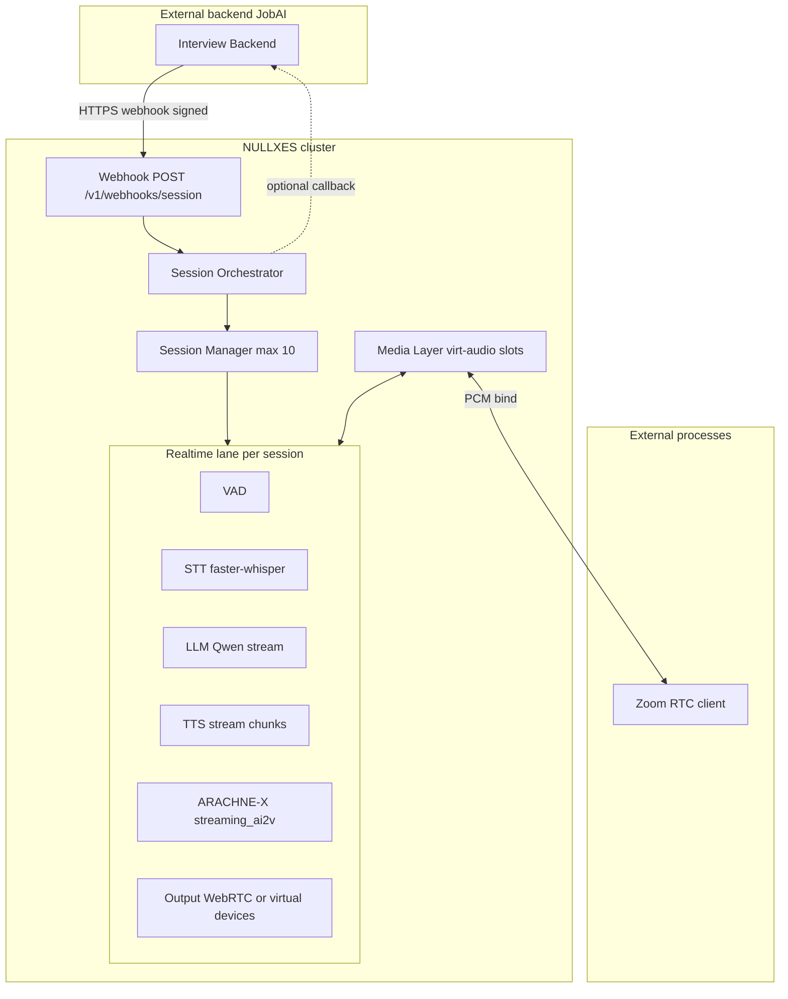

# NULLXES — MVP media layer и API интеграции с внешним backend (JobAI / ARACHNE-X)

**Документ:** техническое описание MVP  
**Сторона:** NULLXES  
**Дата и время:** 03-04-2026 18:30  
**Аудитория:** интеграторы JobAI, platform/backend-инженеры  

---

## 1. Цель MVP

Получить автономный контур **event-driven** оркестрации сессий интервью и **media layer** на **до 10** параллельных real-time сессий:

- Внешний backend (например JobAI) отправляет webhook — NULLXES **сам** планирует и запускает сессию.
- После старта сессия **не требует** постоянного соединения с backend.
- Пайплайн: **User Audio → VAD → STT → LLM → TTS → ARACHNE-X (avatar) → вывод** в режиме **streaming** (в т.ч. частичные ответы LLM → чанки TTS → микро-тёрны аватара).

**Модельные веса:** артефакты **не хранятся в git**; пути к весам задаются на поде (переменные окружения, volume, object storage). Репозиторий содержит код и конфигурацию; загрузка — через существующие механизмы деплоя (см. `arachne_x/weights_resolve.py`).

---

## 2. Архитектура (блок-схема)



**Поток данных (streaming):**

1. Вход: PCM с виртуального capture / RTP / WebRTC receive → VAD → потоковый STT (partial/final).  
2. LLM: поток токенов; в проде — **SpanRouter**: в TTS уходит только speakable-текст.  
3. TTS: PCM/wav чанки → очередь **микро-тёрнов** (см. `arachne_x/tts/chunking.py`, `arachne_x/tts/realtime.py`).  
4. Avatar: на каждый микро-тёрн — шаг `generate_streaming_ai2v`; общий таймлайн с аудио.  
5. Выход: виртуальные устройства (PipeWire/Pulse) и/или WebRTC send.

---

## 3. Компоненты MVP (реализация в репозитории)

| Компонент | Путь / модуль |
|-----------|----------------|
| HTTP-сервер (aiohttp), маршруты | `src/server/webrtc_server.py` |
| Сессии, FSM, идемпотентность | `src/server/session_manager.py` |
| Webhook HMAC | `src/server/webhook_security.py` |
| Media slots, Pulse/PipeWire | `src/server/media_layer.py` |
| Worker пайплайна (очереди, degraded) | `src/server/session_worker.py` |
| Точка входа | `scripts/run_webrtc_server.py` |

---

## 4. API

### 4.1 Webhook (старт / событие сессии)

`POST /v1/webhooks/session`

**Заголовки:**

- `Content-Type: application/json`
- `X-NULLXES-Timestamp`: Unix-секунды (строка)
- `X-NULLXES-Signature`: `v1=<hex_hmac_sha256>` от **сырого тела** с ключом `NULLXES_WEBHOOK_SECRET`
- Опционально: `Idempotency-Key: <uuid>`

**Тело (пример):**

```json
{
  "event": "interview.session.created",
  "session_id": "jobai_sess_abc",
  "correlation_id": "corr-001",
  "config": {
    "locale": "ru-RU",
    "persona_id": "hr_default"
  },
  "callback_url": "https://backend.example/hooks/nullxes"
}
```

**Ответ `202 Accepted`:**

```json
{
  "nullxes_session_id": "nx_...",
  "media_slot": 3,
  "status": "accepted"
}
```

Повтор с тем же `session_id` или `Idempotency-Key` возвращает ту же сессию (идемпотентность).

### 4.2 Управление сессией

| Метод | Путь | Назначение |
|--------|------|------------|
| `POST` | `/v1/sessions/{id}/start` | Перевод в `running`, запуск worker (если ещё не запущен) |
| `POST` | `/v1/sessions/{id}/stop` | Graceful stop: drain, освобождение слота |
| `GET` | `/v1/sessions/{id}/status` | Состояние, health, `media_slot`, `degraded` |

### 4.3 Media binding

| Метод | Путь | Назначение |
|--------|------|------------|
| `GET` | `/v1/media/slots` | Список слотов `0..N-1`, занятость, имена устройств |
| `PATCH` | `/v1/sessions/{id}/media` | Привязка `input_device_id` / `output_device_id` или RTP (поля расширяемы) |

**Пример PATCH:**

```json
{
  "input_device_id": "nx_slot_3_in",
  "output_device_id": "nx_slot_3_out"
}
```

### 4.4 Служебное

- `GET /health` — живость процесса  
- `GET /v1/openapi.json` — машиночитаемое описание маршрутов (MVP)

---

## 5. Media binding matrix (слот ↔ устройство ↔ процесс)

| Слот | Рекомендуемое имя sink (Pulse) | Monitor (захват «выхода» бота) | Процесс |
|------|--------------------------------|--------------------------------|---------|
| 0 | `nx_slot_0` | `nx_slot_0.monitor` | Zoom mic = monitor; динамик кандидата → виртуальный sink input |
| … | … | … | … |
| 9 | `nx_slot_9` | `nx_slot_9.monitor` | Аналогично |

На поде с PipeWire совместимый слой часто предоставляет те же имена через PulseAudio-совместимый API. Точные имена в ответе `GET /v1/media/slots` берутся из рантайма (`pactl` / конфиг).

---

## 6. FSM сессии

`scheduled` → `running` → `draining` → `stopped` | `failed`

- `degraded`: аватар отключён, TTS/аудио может продолжаться (см. worker).  
- После `stop` слот медиа освобождаётся.

---

## 7. Отказоустойчивость (минимум)

- **Backend недоступен:** сессия продолжается по локальному состоянию; исходящие callbacks — best-effort (очередь в памяти MVP; в проде — Redis/disk).  
- **Медиаканал:** счётчик ошибок → перезапуск adapter; после лимита — `degraded` (audio-only) или `failed` с причиной.  
- **GPU/avatar:** ошибки изолируются в worker; API-процесс не падает.

---

## 8. Масштабирование (roadmap)

- Несколько **media nodes**: оркестратор выбирает ноду по загрузке; сессия **sticky**; в webhook-ответе — `media_node_id` + endpoints (WebRTC/RTP).  
- Общее хранилище состояния: Redis при нескольких репликах API.

---

## 9. Переменные окружения (MVP-сервер)

| Переменная | Назначение |
|------------|------------|
| `NULLXES_WEBHOOK_SECRET` | Секрет HMAC; если пусто — проверка отключена (только dev) |
| `NULLXES_AUTO_START_WEBHOOK` | `1` (по умолчанию): после webhook с `interview.session.created` сразу `start` worker; `0` — только ручной `POST .../start` |
| `NULLXES_MEDIA_BACKEND` | `pulse` — попытка `pactl` / null-sink; `stub` — логические слоты без Pulse (Windows/CI) |
| `MAX_CONCURRENT_SESSIONS` | Число слотов (по умолчанию `10`) |
| `NULLXES_SIMULATE_MEDIA_ERRORS` | `1` — накопление `media_errors` для проверки degraded (тесты) |
| `NULLXES_WORKER_STOP_TIMEOUT` | Секунды ожидания graceful stop worker (по умолчанию `30`) |

---

## 10. Ссылки на внутренние документы

- [DIGITAL_EMPLOYEE_SYSTEM_ARCHITECTURE.md](../DOC_CHECK/DIGITAL_EMPLOYEE_SYSTEM_ARCHITECTURE.md)  
- [JobAI_Pilot_Phase1_technical_brief_RU.md](./JobAI_Pilot_Phase1_technical_brief_RU.md)  
- [NULLXES x JobAI integration](../DOC_CHECK/NULLXES%20x%20JobAI%20intregration%20H200%20&%20RTX%206000+.md)  

Реализация HTTP-слоя: `src/server/webrtc_server.py`, `GET /v1/openapi.json`.

---

Конец документа NULLXES, 03-04-2026 18:30.
