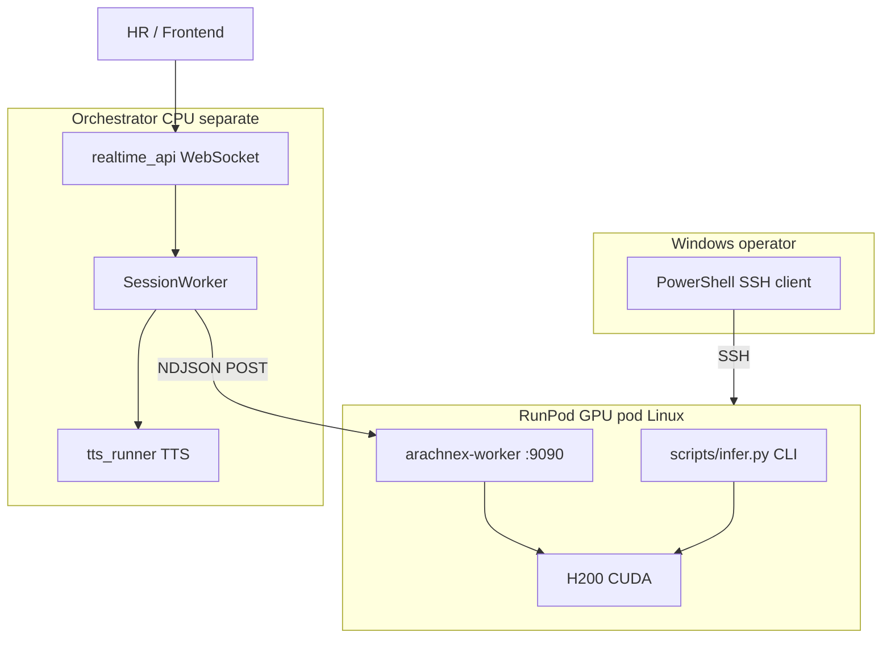

# NULLXES ARACHNE-X — RunPod Deployment Guide

**Document ID:** `NULLXES_ARACHNE_RUNPOD_27-05-2026`  
**Version:** 2026-05-27  
**Branch:** `arachne-last-patch`  
**Audience:** ML ops, backend engineers, enterprise customers self-hosting on RunPod GPU pods

---

## Contacts & licensing

| Channel | Contact |
|---------|---------|
| Email | [ceo@nullxes.com](mailto:ceo@nullxes.com) |
| Telegram | [@MagistrTheOne](https://t.me/MagistrTheOne) |
| Source | [github.com/MagistrTheOne/ARACHNE-X-NULLXES-](https://github.com/MagistrTheOne/ARACHNE-X-NULLXES-.git) |

**License:** NULLXES Proprietary License 2.0 — see [`LICENSE`](../LICENSE).  
Unauthorized modification of code, weights, or model artifacts: **liquidated damages USD $500,000** per violation.

---

## Model weights (Hugging Face)

| Model | URL | Role |
|-------|-----|------|
| **ARACHNE-X-ULTRA-VIDEO** | [huggingface.co/MagistrTheOne/ARACHNE-X-ULTRA-VIDEO](https://huggingface.co/MagistrTheOne/ARACHNE-X-ULTRA-VIDEO) | tokenizer, VAE, scheduler, text encoder, base DiT (`t2v`, `i2v`, `vc`) |
| **ARACHNE-X-ULTRA-AVATAR** | [huggingface.co/MagistrTheOne/ARACHNE-X-ULTRA-AVATAR](https://huggingface.co/MagistrTheOne/ARACHNE-X-ULTRA-AVATAR) | avatar DiT, wav2vec, vocal separator (`ai2v`, `streaming_ai2v`, `at2v`, `avc`) |

Download requires a Hugging Face token with access to both repos.

---

## What you are deploying

ARACHNE-X is a **realtime AI avatar runtime**, not a demo script collection.

```text
Production realtime path:
  WebSocket (orchestrator) → SessionWorker → TTS → GPU worker NDJSON
  → generate_streaming_ai2v → avatar.stream.chunk → client

RunPod CLI path (digitization / QA):
  scripts/infer.py --mode ai2v → MP4
```

Three deployment layers:

| Layer | Where | Purpose |
|-------|-------|---------|
| **CLI inference** | RunPod pod | Digitization, mode tests, LoRA smoke, bench |
| **GPU worker** | `services/arachnex-worker` :9090 | NDJSON realtime frames, MP4 jobs |
| **Orchestrator** | separate CPU host | WebSocket gateway + TTS (not on GPU worker) |

---

## 0. Connect from Windows (PowerShell → RunPod SSH)

Inference runs **on the Linux GPU pod**, not on Windows. Windows is only your **SSH client**.

### 0.1 RunPod pod setup

1. Create a **GPU pod** (recommended: **H200** or H100, ≥250 GB disk).
2. Template: `pytorch/pytorch:2.6.0-cuda12.4-cudnn9-runtime` (or Ubuntu 22.04 + CUDA 12.4).
3. In RunPod UI → **Connect** → copy **SSH over exposed TCP** command, e.g.:

```text
ssh root@<POD_IP> -p <PORT> -i ~/.ssh/id_ed25519
```

4. Expose ports when needed:
   - **9090** — `arachnex-worker` HTTP
   - **22** — SSH (default)

### 0.2 Windows PowerShell (OpenSSH client)

```powershell
# One-time: ensure OpenSSH client is installed (Windows 10/11)
Get-WindowsCapability -Online | Where-Object Name -like 'OpenSSH.Client*'

# Save RunPod private key (from Connect tab) to:
#   C:\Users\<you>\.ssh\runpod_arachne
icacls C:\Users\<you>\.ssh\runpod_arachne /inheritance:r /grant:r "$env:USERNAME:(R)"

# Connect
ssh -i $env:USERPROFILE\.ssh\runpod_arachne root@<POD_IP> -p <PORT>
```

### 0.3 Optional: SCP assets from Windows to pod

```powershell
scp -P <PORT> -i $env:USERPROFILE\.ssh\runpod_arachne `
  "D:\assets\face.jpg" `
  root@<POD_IP>:/workspace/input/face.jpg
```

### 0.4 tmux (keep long jobs alive after disconnect)

```bash
tmux new -s arachne
# ... run infer / worker ...
# Ctrl+B, then D — detach
tmux attach -t arachne
```

---

## 1. Dependency stack (2026 pins)

Install order is **strict**. Do not `pip install -r requirements.txt` before FlashAttention on Linux.

### 1.1 File matrix

| File | Install when | Contents |
|------|--------------|----------|
| [`requirements.txt`](../requirements.txt) | After torch + flash-attn | Core GPU: torch 2.6, diffusers 0.35.1, transformers **4.41.0**, librosa, soundfile, einops, imageio |
| [`requirements_avatar.txt`](../requirements_avatar.txt) | GPU worker / `infer.py` | `-r requirements.txt` + soxr |
| [`requirements_orchestrator.txt`](../requirements_orchestrator.txt) | `src/server` gateway (CPU) | aiohttp, faster-whisper, edge-tts — **not** on dumb GPU-only worker pods |
| [`requirements-tts.txt`](../requirements-tts.txt) | Optional `--speak_text` CLI | Qwen3-TTS (`qwen-tts`) — **separate GPU process recommended** |
| [`requirements-audiodit.txt`](../requirements-audiodit.txt) | **Never** same venv as core | AudioDiT lab — transformers ≥5.3 **conflicts** with core 4.41.0 |
| [`requirements-training.txt`](../requirements-training.txt) | Latent export / WDS only | webdataset, opencv, av, sklearn |
| [`requirements-datasets.txt`](../requirements-datasets.txt) | Dataset prep scripts | `-r requirements-training.txt` + HF `datasets`, pandas |
| [`services/arachnex-worker/requirements.txt`](../services/arachnex-worker/requirements.txt) | Worker HTTP layer | fastapi, uvicorn, pydantic |

Full audit: [`Documentation/REQUIREMENTS.md`](REQUIREMENTS.md).

### 1.2 Pinned core versions

| Component | Version |
|-----------|---------|
| Python | **3.10** or **3.11** (3.10 recommended on RunPod) |
| PyTorch | **2.6.0+cu124** |
| torchvision | **0.21.0+cu124** |
| CUDA (wheel) | **12.4** |
| flash-attn | **2.7.4.post1** (Linux pod only) |
| diffusers | **0.35.1** |
| transformers | **4.41.0** (core avatar runtime) |
| numpy | **1.26.4** |

FlashAttention install (official, [PyPI flash-attn 2.7.4.post1](https://pypi.org/project/flash-attn/2.7.4.post1/)):

```bash
pip install ninja packaging psutil wheel
MAX_JOBS=8 pip install flash-attn==2.7.4.post1 --no-build-isolation
python -c "import flash_attn; print('FLASH OK', flash_attn.__version__)"
```

> **Windows note:** FlashAttention is **not** required on Windows dev machines. Production inference is **Linux GPU only**. Do not attempt full avatar infer on Windows.

---

## 2. Phase-by-phase manual deployment (RunPod)

All commands below run **inside the pod** after SSH connect.

### Phase 0 — GPU & disk check (~1 min)

```bash
nvidia-smi
python3 --version    # expect 3.10+
df -h /workspace     # need ≥250 GB free for both weight repos + venv
```

| Requirement | Minimum |
|-------------|---------|
| GPU | H200 (141 GB VRAM) or H100 |
| Disk | 250 GB free |
| RAM | 64 GB+ recommended for flash-attn compile |

---

### Phase 1 — System packages + git + venv (~10 min)

```bash
apt-get update
apt-get install -y git ffmpeg jq tmux ninja-build build-essential cmake gcc g++ \
  libsndfile1 libgl1
ffmpeg -version

cd /workspace
git clone https://github.com/MagistrTheOne/ARACHNE-X-NULLXES-.git ARACHNE-X
cd /workspace/ARACHNE-X
git fetch origin
git checkout arachne-last-patch
git log -1 --oneline

export ARACHNE_ROOT=/workspace/ARACHNE-X
mkdir -p "$ARACHNE_ROOT/output" /workspace/input

python3 -m venv "$ARACHNE_ROOT/.venv"
source "$ARACHNE_ROOT/.venv/bin/activate"
pip install -U pip setuptools wheel
```

---

### Phase 2 — Hugging Face token & download weights (1–3 hours)

**Never commit tokens.** Use RunPod Secrets or export in shell only.

```bash
source "$ARACHNE_ROOT/.venv/bin/activate"

# RunPod: set HF_TOKEN in pod environment / secrets UI first
export HF_TOKEN="${HF_TOKEN:?Set HF_TOKEN in RunPod secrets before continuing}"
pip install -U "huggingface_hub[cli]>=0.34,<1.0"
huggingface-cli login --token "$HF_TOKEN"
huggingface-cli whoami

pip install hf_transfer
export HF_HUB_ENABLE_HF_TRANSFER=1
mkdir -p "$ARACHNE_ROOT/weights"

# AVATAR (~120 GB) — download first
hf download MagistrTheOne/ARACHNE-X-ULTRA-AVATAR \
  --local-dir "$ARACHNE_ROOT/weights/ARACHNE-X-ULTRA-AVATAR"

# VIDEO (~80 GB) — tokenizer, vae, text_encoder, scheduler, base dit
hf download MagistrTheOne/ARACHNE-X-ULTRA-VIDEO \
  --local-dir "$ARACHNE_ROOT/weights/ARACHNE-X-ULTRA-VIDEO"
```

**Verify AVATAR download:**

```bash
CKPT="$ARACHNE_ROOT/weights/ARACHNE-X-ULTRA-AVATAR"
find "$CKPT" -name '*.incomplete' 2>/dev/null | wc -l   # must be 0
du -sh "$CKPT"
ls "$CKPT/avatar_single"/diffusion_pytorch_model-*.safetensors | wc -l   # expect 6
```

**Wav2vec symlink (required):**

```bash
mkdir -p "$CKPT/audio"
ln -sfn "$CKPT/chinese-wav2vec2-base" "$CKPT/audio/wav2vec2"
```

---

### Phase 3 — Merged runtime layout (~2 min)

Avatar modes use a **symlink bundle** — VIDEO base + AVATAR heads:

```bash
export NULLXES_CHECKPOINT_DIR="$ARACHNE_ROOT/weights/arachne-avatar-runtime"
rm -rf "$NULLXES_CHECKPOINT_DIR" && mkdir -p "$NULLXES_CHECKPOINT_DIR/audio"

for d in tokenizer text_encoder vae scheduler; do
  ln -sfn "$ARACHNE_ROOT/weights/ARACHNE-X-ULTRA-VIDEO/$d" "$NULLXES_CHECKPOINT_DIR/$d"
done
for d in avatar_single avatar_multi vocal_separator; do
  ln -sfn "$ARACHNE_ROOT/weights/ARACHNE-X-ULTRA-AVATAR/$d" "$NULLXES_CHECKPOINT_DIR/$d"
done
ln -sfn "$ARACHNE_ROOT/weights/ARACHNE-X-ULTRA-AVATAR/chinese-wav2vec2-base" \
  "$NULLXES_CHECKPOINT_DIR/audio/wav2vec2"
```

**Verify:**

```bash
export PYTHONPATH="$ARACHNE_ROOT"
python - <<'PY'
from pathlib import Path
import os
root = Path(os.environ["NULLXES_CHECKPOINT_DIR"])
need = ["tokenizer", "vae", "text_encoder", "scheduler", "avatar_single", "audio/wav2vec2"]
missing = [p for p in need if not (root / p).exists()]
print("missing:", missing or "none")
PY
```

---

### Phase 4 — PyTorch + FlashAttention + Python deps (~30–45 min)

**Order is mandatory:** torch → verify CUDA → flash-attn → requirements.

```bash
cd "$ARACHNE_ROOT"
source .venv/bin/activate

pip install --no-cache-dir \
  torch==2.6.0 torchvision==0.21.0 \
  --index-url https://download.pytorch.org/whl/cu124

python -c "import torch; print(torch.__version__, torch.version.cuda, torch.cuda.is_available(), torch.cuda.get_device_name(0))"
# expect: 2.6.0+cu124  12.4  True  NVIDIA H200 ...

pip install ninja packaging psutil wheel
MAX_JOBS=8 pip install flash-attn==2.7.4.post1 --no-build-isolation
python -c "import flash_attn; print('FLASH OK')"
```

Install ML stack (after FLASH OK):

```bash
pip install numpy==1.26.4
pip install -r requirements_avatar.txt
pip install -r services/arachnex-worker/requirements.txt
```

**Optional TTS for CLI `--speak_text` only** (use separate process in prod):

```bash
pip install -r requirements-tts.txt
```

**Do NOT run in same venv:**

```bash
# pip install -r requirements-audiodit.txt   # CONFLICTS — separate container only
```

Sanity import:

```bash
export PYTHONPATH="$ARACHNE_ROOT"
python -c "from arachne_x.loader import load_avatar_pipeline; print('import OK')"
```

---

### Phase 5 — Identity bank enrollment (~2 min, once per persona)

```bash
source "$ARACHNE_ROOT/.venv/bin/activate"
export PYTHONPATH="$ARACHNE_ROOT"
export NULLXES_CHECKPOINT_DIR="$ARACHNE_ROOT/weights/arachne-avatar-runtime"

python scripts/infer.py \
  --checkpoint_dir "$NULLXES_CHECKPOINT_DIR" \
  --mode enroll_identity \
  --image /workspace/input/face.jpg \
  --identity_id 1 \
  --identity_bank_save_path output/persona_identity_bank.pt
```

---

### Phase 6 — CLI smoke: all inference modes

Prepare mono 16 kHz audio:

```bash
ffmpeg -y -i /workspace/input/speech.wav -ar 16000 -ac 1 output/speech_16k.wav
```

#### 6.1 `ai2v` — primary digitization (image + audio + prompt → MP4)

```bash
export ARACHNE_RUNTIME_PROFILE=operational
export ARACHNE_CHUNK_KV=1
export NULLXES_IDENTITY_BANK_PATH="$ARACHNE_ROOT/output/persona_identity_bank.pt"

python scripts/infer.py \
  --checkpoint_dir "$NULLXES_CHECKPOINT_DIR" \
  --mode ai2v \
  --runtime_profile operational \
  --image /workspace/input/face.jpg \
  --audio output/speech_16k.wav \
  --prompt "Person speaking naturally to camera, stable identity, precise lipsync." \
  --negative_prompt "blurry, distorted face, bad anatomy, watermark" \
  --identity_bank_path output/persona_identity_bank.pt \
  --identity_id 1 \
  --resolution 480p \
  --output output/avatar_ai2v.mp4

cat output/avatar_ai2v.run.json   # sampling_metrics: ttff_sec, dit_forwards, ...
```

#### 6.2 `streaming_ai2v` — realtime micro-turn (same pipeline as worker)

```bash
export ARACHNE_INCREMENTAL_WAV2VEC=1   # default ON — partial wav2vec before chunk-0

python scripts/infer.py \
  --checkpoint_dir "$NULLXES_CHECKPOINT_DIR" \
  --mode streaming_ai2v \
  --image /workspace/input/face.jpg \
  --audio output/speech_16k.wav \
  --prompt "Speaking naturally to camera, stable identity." \
  --runtime_profile operational \
  --num_frames 17 \
  --num_inference_steps 8 \
  --output output/avatar_streaming_smoke.mp4
```

#### 6.3 `at2v` — audio + text, no reference image

```bash
python scripts/infer.py \
  --checkpoint_dir "$NULLXES_CHECKPOINT_DIR" \
  --mode at2v \
  --audio output/speech_16k.wav \
  --prompt "Professional speaker, neutral background." \
  --output output/avatar_at2v.mp4
```

#### 6.4 `avc` — video continuation + new audio

```bash
python scripts/infer.py \
  --checkpoint_dir "$NULLXES_CHECKPOINT_DIR" \
  --mode avc \
  --video output/avatar_ai2v.mp4 \
  --audio output/speech_16k.wav \
  --prompt "Same person continuing to speak." \
  --output output/avatar_avc.mp4
```

#### 6.5 Base VIDEO modes (VIDEO weights only, no avatar head)

```bash
# Text-to-video
python scripts/infer.py \
  --checkpoint_dir "$ARACHNE_ROOT/weights/ARACHNE-X-ULTRA-VIDEO" \
  --mode t2v \
  --prompt "Cinematic city at night, rain, neon reflections." \
  --output output/base_t2v.mp4

# Image-to-video
python scripts/infer.py \
  --checkpoint_dir "$ARACHNE_ROOT/weights/ARACHNE-X-ULTRA-VIDEO" \
  --mode i2v \
  --image /workspace/input/scene.jpg \
  --prompt "Camera slowly pans, natural motion." \
  --output output/base_i2v.mp4

# Video continuation
python scripts/infer.py \
  --checkpoint_dir "$ARACHNE_ROOT/weights/ARACHNE-X-ULTRA-VIDEO" \
  --mode vc \
  --video output/base_i2v.mp4 \
  --prompt "Continue the scene smoothly." \
  --output output/base_vc.mp4
```

#### 6.6 Mode reference table

| `--mode` | Weights | Required inputs | Output | Use case |
|----------|---------|-----------------|--------|----------|
| **`ai2v`** | merged avatar | image + audio + prompt | MP4 | **Primary digitization** |
| **`streaming_ai2v`** | merged avatar | image + audio + prompt | MP4 / frames | Realtime TTFF path |
| **`at2v`** | merged avatar | audio + prompt | MP4 | Talking head without ref photo |
| **`avc`** | merged avatar | video + audio + prompt | MP4 | Continuation / speech swap |
| **`enroll_identity`** | merged avatar | image + `--identity_id` | `.pt` bank | Identity slot for guided infer |
| **`t2v`** | ULTRA-VIDEO | prompt | MP4 | Base text→video |
| **`i2v`** | ULTRA-VIDEO | image + prompt | MP4 | Base image→video |
| **`vc`** | ULTRA-VIDEO | video + prompt | MP4 | Base video continuation |
| `audio_i2v` | lab adapter | image + prompt | MP4 | **Lab only** — not prod avatar path |
| `imagine_i2v` | lab adapter | image + prompt | MP4 | **Lab only** |

**Runtime profiles:**

| Profile | Behavior |
|---------|----------|
| `operational` (default prod) | Chunked denoise + distill ~12 steps, KV cross-chunk, TTFF optimized |
| `cinematic` | Monolithic denoise, higher quality, slower TTFF |

```bash
export ARACHNE_RUNTIME_PROFILE=operational   # or cinematic
# rollback monolithic streaming:
export ARACHNE_LEGACY_STREAMING=1
```

**Quality knobs (avatar modes):**

| Flag | Default | Notes |
|------|---------|-------|
| `--resolution` | `480p` | `480p` or `720p` only |
| `--num_frames` | 93 | Must follow **4n+1** rule |
| `--num_inference_steps` | 50 (cinematic) / 12 (operational profile) | |
| `--audio_guidance_scale` | 4.0 | Prod lipsync often **5.0–5.5** |
| `--text_guidance_scale` | 4.0 | |
| `--chunk_frames` | 33 | Chunked path window size |
| `--chunk_overlap` | 8 | Stitch overlap |

---

### Phase 7 — GPU worker HTTP :9090 (realtime production)

**Worker contract:** PCM16 + image + prompt in → RGB NDJSON frames out. **No TTS inside GPU process.**

```bash
source "$ARACHNE_ROOT/.venv/bin/activate"
export PYTHONPATH="$ARACHNE_ROOT:$ARACHNE_ROOT/services/arachnex-worker"
export NULLXES_CHECKPOINT_DIR="$ARACHNE_ROOT/weights/arachne-avatar-runtime"
export ARACHNE_RUNTIME_PROFILE=operational
export ARACHNE_CHUNK_KV=1
export ARACHNE_INCREMENTAL_WAV2VEC=1
export NULLXES_IDENTITY_BANK_PATH="$ARACHNE_ROOT/output/persona_identity_bank.pt"

# Streaming queue (Wave 1 hardening — defaults shown)
export ARACHNE_STREAM_MAX_ACTIVE_JOBS=1
export ARACHNE_STREAM_MAX_QUEUE=3
export ARACHNE_STREAM_QUEUE_TIMEOUT_SEC=15

# Optional auth (recommended prod)
# export NULLXES_INFERENCE_SERVICE_KEY="your-secret"

tmux new -s arachne-worker
cd "$ARACHNE_ROOT/services/arachnex-worker"
uvicorn main:app --host 0.0.0.0 --port 9090
```

**RunPod:** expose TCP **9090** → public URL like `https://<pod-id>-9090.proxy.runpod.net`

#### Worker endpoints

| Method | Path | Description |
|--------|------|-------------|
| GET | `/health` | Lifecycle, queue depth, VRAM, gpuVisible |
| GET | `/v1/runtime/metrics` | Queue rejects, wait times, active jobs (auth key if set) |
| POST | `/v1/realtime/avatar_frames` | NDJSON RGB stream (PCM16 in) |
| POST | `/v1/arachne/generate` | Sync MP4 (audio-image tasks) |
| POST | `/v1/infer/jobs` | Async MP4 job queue |
| POST | `/v1/admin/drain` | Stop admitting new streams (auth key) |
| POST | `/v1/admin/activate` | Resume admitting streams (auth key) |

#### Smoke on pod

```bash
curl -fsS http://127.0.0.1:9090/health | jq .

# overload reject test (send 5 parallel requests — expect 503 worker_busy on overflow)
curl -fsS http://127.0.0.1:9090/v1/runtime/metrics \
  -H "X-NULLXES-Avatar-Inference-Key: $NULLXES_INFERENCE_SERVICE_KEY" | jq .
```

NDJSON frame smoke (if `scripts/gpu/smoke_avatar_frames.sh` exists):

```bash
export NULLXES_URL=http://127.0.0.1:9090
bash "$ARACHNE_ROOT/scripts/gpu/smoke_avatar_frames.sh"
```

---

### Phase 8 — Orchestrator wiring (separate CPU host)

Point your realtime gateway / SessionWorker at the worker:

```bash
# Single worker
export NULLXES_AVATAR_INFERENCE_URL=https://<pod-id>-9090.proxy.runpod.net
export NULLXES_AVATAR_INFERENCE_SERVICE_KEY=your-secret

# Multi-worker pool (session hash routing)
export NULLXES_AVATAR_WORKER_URLS=https://pod-a-9090.proxy.runpod.net,https://pod-b-9090.proxy.runpod.net
```

Orchestrator path (see [`ARCHITECTURE.md`](../ARCHITECTURE.md)):

```text
WebSocket → session_worker.py → realtime_avatar_loop.py → avatar_stream_client.py
  → POST /v1/realtime/avatar_frames → avatar.stream.chunk
```

TTS runs in orchestrator (`src/server/tts_runner.py`), **not** in GPU worker.

---

## 3. Environment variables reference

### Weights & paths

| Variable | Required | Description |
|----------|----------|-------------|
| `NULLXES_CHECKPOINT_DIR` | **Yes** (worker/avatar) | Merged avatar runtime path |
| `ARACHNE_CHECKPOINT_DIR` | Alt | Same as above |
| `NULLXES_IDENTITY_BANK_PATH` | Recommended | Path to `.pt` identity bank |
| `PYTHONPATH` | **Yes** | `$ARACHNE_ROOT` (+ worker dir for uvicorn) |
| `HF_TOKEN` | Download only | Hugging Face CLI token — never commit |

### Runtime / sampling

| Variable | Default | Description |
|----------|---------|-------------|
| `ARACHNE_RUNTIME_PROFILE` | `operational` | `operational` \| `cinematic` |
| `ARACHNE_LEGACY_STREAMING` | off | `1` = monolithic denoise rollback |
| `ARACHNE_CHUNK_KV` | off | `1` = cross-chunk KV seed |
| `ARACHNE_INCREMENTAL_WAV2VEC` | `1` | Partial wav2vec before chunk-0 (TTFF) |
| `ARACHNE_INCREMENTAL_WAV2VEC_MIN_MS` | auto | Override prefix audio ms (e.g. `400`) |
| `ARACHNE_INFER_ENABLE_BSA` | off | Block sparse attention (inference only) |

### Worker queue (Wave 1)

| Variable | Default | Description |
|----------|---------|-------------|
| `ARACHNE_STREAM_MAX_ACTIVE_JOBS` | `1` | Concurrent GPU streams |
| `ARACHNE_STREAM_MAX_QUEUE` | `3` | Waiting slots before reject |
| `ARACHNE_STREAM_QUEUE_TIMEOUT_SEC` | `15` | Max wait in queue |
| `ARACHNE_STREAM_ESTIMATED_JOB_MS` | `8000` | `retryAfterMs` hint |
| `INFERENCE_MAX_QUEUE` | `32` | Async MP4 job queue depth |

### Auth

| Variable | Description |
|----------|-------------|
| `NULLXES_INFERENCE_SERVICE_KEY` | Worker auth header `X-NULLXES-Avatar-Inference-Key` |
| `NULLXES_AVATAR_INFERENCE_SERVICE_KEY` | Alias (orchestrator client) |

### Orchestrator → worker

| Variable | Description |
|----------|-------------|
| `NULLXES_AVATAR_INFERENCE_URL` | Single worker base URL |
| `NULLXES_AVATAR_WORKER_URLS` | Comma-separated pool for hash routing |
| `NULLXES_AVATAR_INFERENCE_RETRY_MAX` | Client retry count on `503 worker_busy` (default 3) |

---

## 4. Production architecture diagram



---

## 5. RunPod smoke checklist (Wave 1 validation)

Run after deploy. Record results in your ops log.

| # | Check | Command / signal | Pass |
|---|-------|------------------|------|
| 1 | GPU visible | `nvidia-smi` | H200/H100 OK |
| 2 | FlashAttention | `import flash_attn` | FLASH OK |
| 3 | Weights layout | Phase 3 verify script | `missing: none` |
| 4 | CLI ai2v | Phase 6.1 | MP4 + `.run.json` |
| 5 | TTFF metrics | `.run.json` → `sampling_metrics.ttff_sec` | ≤ 4s operational |
| 6 | Incremental wav2vec | `.run.json` → `wav2vec_partial_sec` present | partial < full |
| 7 | Worker health | `curl /health` | `status: ok`, `gpuVisible: true` |
| 8 | Queue metrics | `curl /v1/runtime/metrics` | queue fields present |
| 9 | Overload reject | 4+ parallel stream POSTs | `503 worker_busy` + `retryAfterMs` |
| 10 | NDJSON frames | smoke_avatar_frames.sh | rgb24 lines with seq |

---

## 6. Troubleshooting

| Symptom | Likely cause | Fix |
|---------|--------------|-----|
| `ModuleNotFoundError: torch` during flash-attn pip | Build isolation | `pip install flash-attn==2.7.4.post1 --no-build-isolation` |
| flash-attn compile OOM | Too many parallel jobs | `MAX_JOBS=4 pip install ...` |
| `CUDA not available` | Wrong torch wheel | Reinstall cu124 index URL wheel |
| `missing: audio/wav2vec2` | Symlink not created | Phase 3 wav2vec symlink |
| Worker 401 | Missing inference key | Set header or unset key env on pod |
| Worker 503 `worker_busy` | Queue full (expected under load) | Retry with `retryAfterMs`; scale workers |
| TTFF still high | `ARACHNE_INCREMENTAL_WAV2VEC=0` or cinematic profile | Enable incremental + operational profile |
| TTS OOM on worker | TTS loaded in GPU process | **Move TTS to orchestrator only** |
| transformers conflict | Mixed audiodit + core venv | Separate venv/container for AudioDiT |

---

## 7. Related documents

| Document | Purpose |
|----------|---------|
| [`ARCHITECTURE.md`](../ARCHITECTURE.md) | Canonical prod path, endpoints |
| [`RUNPOD_H200_AVATAR_SETUP.md`](../RUNPOD_H200_AVATAR_SETUP.md) | Extended H200 playbook (legacy sections) |
| [`services/arachnex-worker/README.md`](../services/arachnex-worker/README.md) | Worker HTTP contract |
| [`LICENSE`](../LICENSE) | NULLXES Proprietary License 2.0 |

---

## 8. Customer handoff summary

To run ARACHNE-X on your own RunPod:

1. **SSH from Windows PowerShell** into a GPU pod (§0).
2. **Clone** `arachne-last-patch` and create venv (§1–2).
3. **Download weights** from [ULTRA-AVATAR](https://huggingface.co/MagistrTheOne/ARACHNE-X-ULTRA-AVATAR) + [ULTRA-VIDEO](https://huggingface.co/MagistrTheOne/ARACHNE-X-ULTRA-VIDEO) (§2).
4. **Install** torch 2.6+cu124 → flash-attn 2.7.4.post1 → requirements_avatar.txt (§4).
5. **Smoke** with `scripts/infer.py --mode ai2v` (§6).
6. **Start worker** on :9090 for realtime (§7).
7. **Wire orchestrator** with `NULLXES_AVATAR_INFERENCE_URL` (§8).

Support: **ceo@nullxes.com** | Telegram **@MagistrTheOne**

**Do not modify code or weights without written NULLXES authorization** — see [`LICENSE`](../LICENSE).
