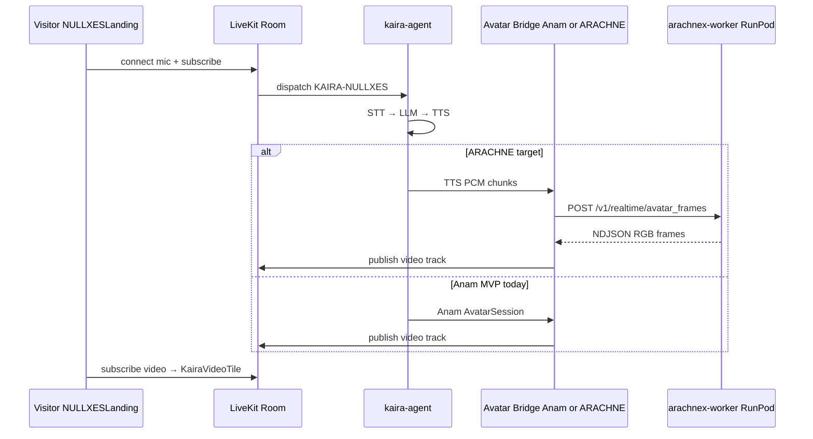

# NULLXES Deployment — ARACHNE-X × LiveKit × KAIRA

| Поле | Значение |
|------|----------|
| **Дата** | 25.05.2026 |
| **Статус** | Активный deployment guide (Landing + KAIRA) |
| **Репозиторий ARACHNE-X** | `ARACHNE-X/` в монорепо NULLXES HR AI |
| **Связанные контуры** | `kaira-agent/nullxes-kaira`, `NULLXESLanding` |
| **Inference Worker** | `services/arachnex-worker` (NIGHT FURY) |

Этот документ фиксирует **как поднять GPU-аватар на поде** и **как подключить его к продуктовому контуру NULLXES** (LiveKit Agents + лендинг). Детали RunPod one-shot и HTTP-контракты — в связанных GTM-доках (ссылки в конце).

---

## 0. Для кого и что решает

| Роль | Читать |
|------|--------|
| ML ops / RunPod | §3–§5 — под, веса, воркер, smoke |
| Backend / agents | §6 — bridge kaira-agent → воркер → LiveKit track |
| Frontend | §7 — NULLXESLanding (рендер без доработок под ARACHNE) |
| Архитектор | §2, §8, §9 — границы контуров и аудит |

**Ключевая мысль:** под + фото + `arachnex-worker` дают **HTTP-поток кадров**. LiveKit **не** подключается к поду напрямую. В комнату кадры публикует **слой bridge** (сейчас — Anam plugin в `kaira-agent`; целевой — **ARACHNE bridge**).

---

## 1. Контуры продукта (что в scope на 25.05.2026)

| Контур | In scope | Out of scope (отдельные эпики) |
|--------|----------|----------------------------------|
| **NULLXESLanding** | PiP KAIRA, LiveKit client, video track render | `frontend/jobaidemo`, studio |
| **kaira-agent** | STT → LLM → TTS, dispatch `KAIRA-NULLXES`, avatar publish | Operator tools — не блокируют avatar |
| **arachnex-worker** | NDJSON `/v1/realtime/avatar_frames`, MP4 jobs | FURIA-EIDOLON, ULTRA-VIDEO прероллы в realtime |
| **realtime-gateway** | Упомянут как HR-путь | Не обязателен для Landing |

---

## 2. Архитектура (целевая)

### 2.1 Слои

```
┌─────────────────────────────────────────────────────────────────┐
│  NULLXESLanding — Behavior UI (mic, chat, PiP, session limit)   │
│  livekit-client → subscribe RemoteVideoTrack                    │
├─────────────────────────────────────────────────────────────────┤
│  LiveKit Cloud — room, SFU, Agent dispatch                      │
├─────────────────────────────────────────────────────────────────┤
│  kaira-agent — voice agent (Deepgram / OpenAI / ElevenLabs)     │
│  + Avatar publish: Anam (MVP) | ARACHNE bridge (target)         │
├─────────────────────────────────────────────────────────────────┤
│  RunPod GPU — arachnex-worker :9090                             │
│  streaming_ai2v / avatar_frames NDJSON                          │
├─────────────────────────────────────────────────────────────────┤
│  ARACHNE-X weights — merged avatar runtime + optional LoRA      │
└─────────────────────────────────────────────────────────────────┘
```

### 2.2 Поток realtime (KAIRA на лендинге)



### 2.3 Два независимых пути включения

| Режим | Что поднимаете | Что видит пользователь |
|-------|----------------|------------------------|
| **A. Только под** | RunPod + worker + фото + smoke `curl` | MP4 / NDJSON в логах; **без** LiveKit |
| **B. Полный продукт** | A + kaira-agent (bridge) + LiveKit + Landing | Говорящий KAIRA в PiP на сайте |

Переключение персонажа в режиме A: новая **фотка** + JSON-пресет на поде. Режим B: то же на поде + конфиг bridge (cond image / prompt); **лендинг не пересобирать**.

---

## 3. RunPod / GPU pod — Inference Worker

Канонический one-shot: [`DOC_CHECK/GTM_ONE_SHOT_DEPLOY.md`](DOC_CHECK/GTM_ONE_SHOT_DEPLOY.md).  
Расширенный H200 runbook: [`../RUNPOD_H200_AVATAR_SETUP.md`](../RUNPOD_H200_AVATAR_SETUP.md).

### 3.1 Обязательные переменные (worker)

| Переменная | Обяз. | Назначение |
|------------|-------|------------|
| `NULLXES_CHECKPOINT_DIR` | да* | Merged avatar runtime (`tokenizer/`, `vae/`, `avatar_single/`, `audio/`, …). *Алиас: `ARACHNE_CHECKPOINT_DIR`. |
| `NULLXES_INFERENCE_SERVICE_KEY` | нет | Секрет; заголовок `X-NULLXES-Avatar-Inference-Key`. Алиасы: `NULLXES_AVATAR_INFERENCE_SERVICE_KEY`, `LONGCAT_INFERENCE_SERVICE_KEY`. |

### 3.2 Запуск (канонический путь)

```bash
export NULLXES_CHECKPOINT_DIR=/runpod-volume/weights/arachne-avatar-runtime
export PYTHONPATH=/workspace/ARACHNE-X:/workspace/ARACHNE-X/services/arachnex-worker
cd /workspace/ARACHNE-X/services/arachnex-worker
uvicorn main:app --host 0.0.0.0 --port 9090
```

Сервис: [`services/arachnex-worker/README.md`](../services/arachnex-worker/README.md).

### 3.3 Endpoints (prod)

| Method | Path | Назначение |
|--------|------|------------|
| GET | `/health` | Liveness; **не** грузит веса |
| POST | `/v1/realtime/avatar_frames` | **Realtime** — NDJSON RGB (`application/x-ndjson`) |
| POST | `/v1/arachne/generate` | Синхронный MP4 |
| POST | `/v1/infer/jobs` | Async MP4 queue |

Поле `engine` в теле NDJSON: `arachne` (default), `nullxes`, `core`, `""`, legacy `longcat`; алиасы HR: `arachne_ultra_avatar`, `arachne_ultra_video` → тот же core pipeline.

### 3.4 Startup order

1. Pod GPU (H200 preferred), volume с весами.
2. `NULLXES_CHECKPOINT_DIR` + опционально inference key.
3. uvicorn → `curl -fsS http://127.0.0.1:9090/health` → `{"status":"ok"}`.
4. **Warmup:** первый `POST /v1/realtime/avatar_frames` грузит пайплайн на GPU (30–120+ с с сетевого диска) — не путать с health.

### 3.5 Smoke NDJSON

```bash
# из корня ARACHNE-X, когда NULLXES_URL указывает на публичный proxy пода
NULLXES_URL=https://<pod-proxy> bash scripts/gpu/smoke_avatar_frames.sh
```

Схема тела: `sessionId`, `imageBase64`, `audioPcm16Base64` (mono 16 kHz) или `audioFloat32Base64`, `prompt`, `resolution`, `numFrames`, … — см. [`DOC_CHECK/GTM_SCHEMA_TRUTH_INFERENCE_HTTP.md`](DOC_CHECK/GTM_SCHEMA_TRUTH_INFERENCE_HTTP.md).

---

## 4. Персонаж: фото + пресет (KAIRA)

Канон для Landing-контура KAIRA:

| Артефакт | Путь |
|----------|------|
| Портрет | `assets/avatar/single/kaira/kaira.png` |
| Пресет infer | `assets/avatar/single/kaira/kaira.json` |

Пресет задаёт prompt, `480p`, короткий realtime smoke (`num_frames: 17`, малые steps). **Аудио в runtime** приходит с TTS агента (ElevenLabs / OpenAI) как **PCM16 mono 16 kHz**, не из статического WAV в JSON.

Добавление нового лица (Elena, Svetlana, …): `assets/avatar/single/<name>/` + тот же контракт — см. [`JOB_AI_AVATAR_RUNBOOK_2026-05-21.md`](JOB_AI_AVATAR_RUNBOOK_2026-05-21.md).

---

## 5. «В любой момент подняли под» — чеклист

| # | Действие | Готово когда |
|---|----------|--------------|
| 1 | Веса на volume, `NULLXES_CHECKPOINT_DIR` | layout по `WeightsLayout` / `loader.py` |
| 2 | `arachnex-worker` слушает `:9090` | `/health` OK |
| 3 | Фото + `*.json` пресет на поде или base64 в запросе | smoke NDJSON 200, строки с кадрами |
| 4 | Публичный URL RunPod proxy | `NULLXES_URL` доступен с агента |
| 5 | Один inference key на поде и у клиента bridge | 401 нет |

**После шага 5** под готов как **inference backend**. LiveKit — шаги §6.

---

## 6. LiveKit + kaira-agent — подключение к продукту

Репозиторий агента: `kaira-agent/nullxes-kaira/` (вне дерева `ARACHNE-X`, но часть deployment NULLXES).

### 6.1 Что уже работает без ARACHNE

| Компонент | Поведение |
|-----------|-----------|
| `kaira-agent` | `AgentServer`, `@server.rtc_session(agent_name=KAIRA-NULLXES)` |
| Anam | `ANAM_AVATAR_ID` + `ANAM_API_KEY` → `anam.AvatarSession` → video track |
| NULLXESLanding | `useKairaSession` → dispatch agent → `KairaVideoTile` на `RemoteVideoTrack` |

### 6.2 Целевой ARACHNE bridge (слой интеграции)

| Задача | Владелец | Статус на 25.05.2026 |
|--------|----------|----------------------|
| Tap TTS PCM из `AgentSession` | kaira-agent | **Планируется** (аналог lifecycle `AvatarSession`) |
| HTTP → `NULLXES_AVATAR_INFERENCE_URL` + `/v1/realtime/avatar_frames` | kaira-agent | **Планируется** |
| RGB → encode → `VideoSource` publish | kaira-agent | **Планируется** |
| Feature flag `ARACHNE_AVATAR_ENABLED` vs `ANAM_AVATAR_ID` | kaira-agent env | **Планируется** |

Референс паттерна LiveKit: [Virtual avatars](https://docs.livekit.io/frontends/build/virtual-avatars/) — plugin рядом с агентом, video = обычный track; фронт без изменений.

### 6.3 Env — kaira-agent (минимум)

| Переменная | Назначение |
|------------|------------|
| `LIVEKIT_URL` | WSS проекта |
| `LIVEKIT_API_KEY` / `LIVEKIT_API_SECRET` | Cloud Agents |
| `KAIRA_AGENT_NAME` | Должен совпадать с dispatch на лендинге (`KAIRA-NULLXES`) |
| `DEEPGRAM_*`, `OPENAI_*`, `ELEVENLABS_*` | Voice stack |
| `ANAM_AVATAR_ID` | MVP avatar (если ARACHNE bridge выключен) |
| `NULLXES_AVATAR_INFERENCE_URL` | Base URL пода, без `/` в конце |
| `NULLXES_AVATAR_INFERENCE_SERVICE_KEY` | = ключ на поде, если включён |
| `NULLXES_AVATAR_INFERENCE_FRAMES_PATH` | Default `/v1/realtime/avatar_frames` |
| `ARACHNE_AVATAR_COND_IMAGE` | Путь или URL к `kaira.png` (bridge) |
| `ARACHNE_AVATAR_PROMPT` | Override или загрузка из `kaira.json` |

### 6.4 Env — оркестратор (если не bridge в агенте, а HR gateway)

Для `realtime-gateway` (Job.ai / HR плашка) — те же URL/ключи, плюс `VIDEO_ENGINE=arachne_ultra_avatar`. См. § «NULLXES HR AI» в [`GTM_ONE_SHOT_DEPLOY.md`](DOC_CHECK/GTM_ONE_SHOT_DEPLOY.md). **Landing не использует gateway** в текущем UPD.

### 6.5 Деплой агента

```bash
# в kaira-agent/nullxes-kaira — по README проекта
uv run agent.py dev   # local
# production: LiveKit Cloud agent deploy (Dockerfile в репо)
```

---

## 7. NULLXESLanding — фронт

| Тема | Состояние |
|------|-----------|
| Рендер avatar video | `KairaVideoTile` + `track.attach()` — **готово** |
| Fallback без track | `/kaira.png` — **готово** |
| Agent dispatch | `RoomAgentDispatch` + `KAIRA_AGENT_NAME` — **готово** |
| Session limit | `VITE_KAIRA_SESSION_LIMIT_SECONDS` (default 210s) — **готово** |
| **Security P0** | JWT с `LIVEKIT_API_SECRET` в браузере (`useKairaSession`) — **перенести на serverless token** (`api/token.ts` по README лендинга) |

Фронт **не** знает про ARACHNE / RunPod — только LiveKit tracks.

---

## 8. Фазы внедрения

| Фаза | Содержание | Выход |
|------|------------|-------|
| **0** | Baseline: Anam или static fallback; smoke под | Демо на Landing |
| **1** | ARACHNE bridge в kaira-agent, HTTP NDJSON, 480p KAIRA preset | Свой лик в PiP |
| **2** | Latency: меньшие `num_frames`/steps, turn-boundary flush | Приемлемый lip-sync |
| **3** | LoRA KAIRA на поде, prompt compiler prod | Стабильная идентичность |
| **4** | Token API server-side, метрики, degraded mode | Production hardening |

---

## 9. Scope аудита (краткий)

Полный чеклист для ревью перед prod.

### 9.1 Pod / worker

- [ ] `/health` без загрузки GPU
- [ ] Warmup NDJSON после деплоя
- [ ] Auth header при включённом ключе
- [ ] Queue `INFERENCE_MAX_QUEUE` под пик Landing
- [ ] OOM recovery, логи `sessionId` / `chunkBytes`

### 9.2 kaira-agent + bridge

- [ ] Dispatch name = Landing
- [ ] Один video publisher (не дубли Anam + ARACHNE)
- [ ] Cancel / flush при barge-in / новый turn
- [ ] Cold start пода не рвёт комнату (degraded → Anam или static)

### 9.3 NULLXESLanding

- [ ] Token только server-side (P0)
- [ ] Reconnect / expire session cleanup
- [ ] Mobile autoplay mic/video

### 9.4 LiveKit Cloud

- [ ] Agent registered, scaling
- [ ] Codec/simulcast для avatar track

---

## 10. Operational risks (NULLXES doctrine)

| Риск | Где | Митигация |
|------|-----|-----------|
| RTT Cloud Agent → RunPod | bridge | Colocation; фаза 2 in-process на GPU рядом с worker |
| Lip-sync drift | turn boundaries | Буфер PCM по turn; не публиковать кадры без audio window |
| Reconnect storm | Landing + LK | Idempotent disconnect; один avatar participant |
| Cold start 30–120+ s | worker | Scheduled warmup после deploy |
| Partial NDJSON | HTTP client | Structured error; не fake healthy UI state |
| Секреты в Vite bundle | Landing | Serverless token only |

---

## 11. Связанные документы

| Документ | Содержание |
|----------|------------|
| [`ARCHITECTURE.md`](../ARCHITECTURE.md) | Слои DiT / LoRA / runtime policy |
| [`DOC_CHECK/ARACHNE-X_ARCHITECTURE_SPEC_NULLXES.md`](DOC_CHECK/ARACHNE-X_ARCHITECTURE_SPEC_NULLXES.md) | Статический обзор репозитория |
| [`DOC_CHECK/GTM_ONE_SHOT_DEPLOY.md`](DOC_CHECK/GTM_ONE_SHOT_DEPLOY.md) | RunPod one-shot, env, NDJSON schema summary |
| [`DOC_CHECK/GTM_PRODUCTION_CONTRACT.md`](DOC_CHECK/GTM_PRODUCTION_CONTRACT.md) | Единый production-контур |
| [`DOC_CHECK/GTM_SCHEMA_TRUTH_INFERENCE_HTTP.md`](DOC_CHECK/GTM_SCHEMA_TRUTH_INFERENCE_HTTP.md) | HTTP ↔ worker truth |
| [`RUNPOD_H200_AVATAR_SETUP.md`](../RUNPOD_H200_AVATAR_SETUP.md) | H200, path A/B gateway vs pod |
| [`JOB_AI_AVATAR_RUNBOOK_2026-05-21.md`](JOB_AI_AVATAR_RUNBOOK_2026-05-21.md) | Оцифровка Elena/Svetlana, MP4 |
| [`services/arachnex-worker/README.md`](../services/arachnex-worker/README.md) | Endpoints worker |
| LiveKit | [Virtual avatars](https://docs.livekit.io/frontends/build/virtual-avatars/) |

---

## 12. Резюме одной строкой

**Под + фото + worker** = готовый GPU-аватар по HTTP. **LiveKit + Landing** = нужен **kaira-agent** с публикацией video track (Anam сейчас, ARACHNE bridge — целевой). Включение нового лица = смена assets на поде и конфига bridge, без обязательной пересборки лендинга.

---

**NULLXES LLC** · internal deployment · 25.05.2026
