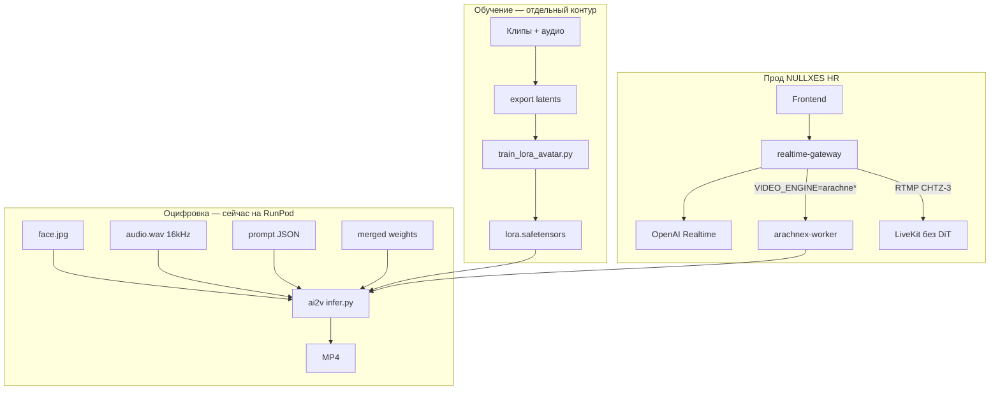
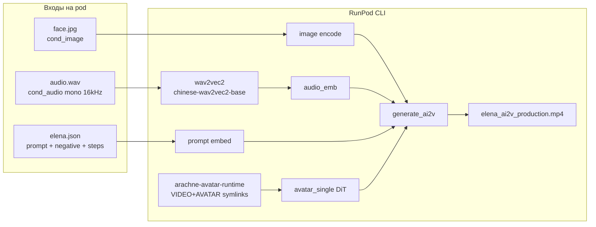
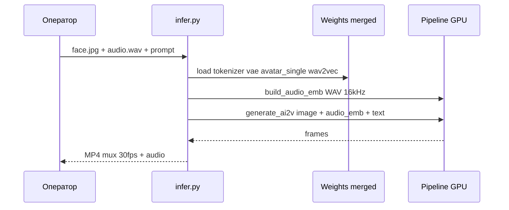
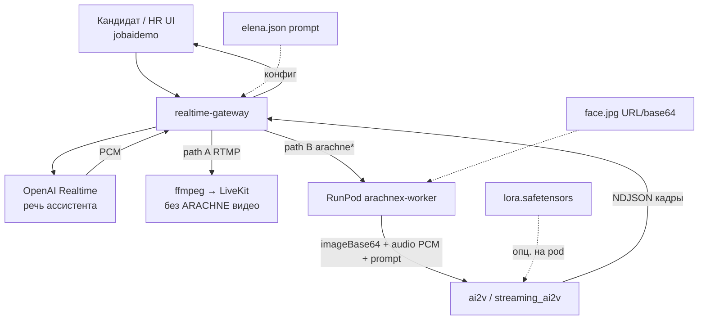

# RunPod H200 — ARACHNE-X AVATAR (оцифровка + тесты режимов CLI)

Playbook для **RunPod GPU H200** (H100 — те же шаги, медленнее): веса → merged runtime → `scripts/infer.py` по режимам.

**Текущий этап:** оцифровка и прогон режимов **только через CLI**. HTTP-воркер (`services/arachnex-worker`) — **не обязателен**; см. §5, когда понадобится realtime NDJSON для HR.


| Артефакт                                  | URL                                                                                                    |
| ----------------------------------------- | ------------------------------------------------------------------------------------------------------ |
| Исходники                                 | [github.com/MagistrTheOne/ARACHNE-X-NULLXES-](https://github.com/MagistrTheOne/ARACHNE-X-NULLXES-.git) |
| Веса AVATAR                               | [MagistrTheOne/ARACHNE-X-ULTRA-AVATAR](https://huggingface.co/MagistrTheOne/ARACHNE-X-ULTRA-AVATAR)    |
| Веса VIDEO (база tokenizer/vae/dit + T2V) | [MagistrTheOne/ARACHNE-X-ULTRA-VIDEO](https://huggingface.co/MagistrTheOne/ARACHNE-X-ULTRA-VIDEO)      |


Основной режим оцифровки: **`ai2v`** (image + audio + prompt) → MP4. Остальные режимы — §4.

Связанные документы: [`GTM_ONE_SHOT_DEPLOY.md`](Documentation/DOC_CHECK/GTM_ONE_SHOT_DEPLOY.md), [`GTM_PRODUCTION_CONTRACT.md`](Documentation/DOC_CHECK/GTM_PRODUCTION_CONTRACT.md), [`RUNPOD_SEMIAUTO_PIPELINE.md`](Documentation/DOC_CHECK/RUNPOD_SEMIAUTO_PIPELINE.md), воркер: [`services/arachnex-worker/README.md`](services/arachnex-worker/README.md).

---

## Обзор ARACHNE-X (возможности, режимы, развёртывание)

### Продукт в одном абзаце

**ARACHNE-X** — proprietary video/avatar diffusion stack (DiT + Wan VAE + UMT5 text + Wav2Vec2 audio). **Оцифровка** = inference на frozen чекпоинтах HF (`ULTRA-VIDEO` + `ULTRA-AVATAR`). **Персонализация** = LoRA (`train_lora_avatar.py`) и/или identity bank (`enroll_identity`). **Прод HR** может идти двумя путями: **RTMP** (голос OpenAI → LiveKit, без DiT) или **GPU worker** (кадры `streaming_ai2v` / NDJSON).

### Две линейки весов

| Repo HF | Роль | Нужен для |
| ------- | ---- | --------- |
| [ARACHNE-X-ULTRA-VIDEO](https://huggingface.co/MagistrTheOne/ARACHNE-X-ULTRA-VIDEO) | tokenizer, VAE, scheduler, text_encoder, base DiT | `t2v`, `i2v`, `vc` + **база** merged avatar |
| [ARACHNE-X-ULTRA-AVATAR](https://huggingface.co/MagistrTheOne/ARACHNE-X-ULTRA-AVATAR) | avatar_single/multi, wav2vec, vocal_separator | `ai2v`, `at2v`, `avc`, `streaming_ai2v` |

**Merged runtime** (`weights/arachne-avatar-runtime`) — symlink-bundle для всех avatar-режимов (§2.4).

### Оцифровка vs обучение (механика для команды)



| Этап | Что делает | Артефакт |
| ---- | ---------- | -------- |
| Оцифровка | `ai2v` на общих ULTRA-весах | MP4 QA / демо |
| LoRA | дообучение адаптера на латентах | `.safetensors` → `--lora_path` |
| Identity | `enroll_identity` с одного фото | `identity_bank.pt` |
| Realtime HR | gateway → worker `avatar_frames` | NDJSON RGB |
| Interview RTMP | PCM → ffmpeg → LiveKit | аудио-бот без ARACHNE-кадров |

Пресеты: `assets/avatar/single/<name>/*.json` (например **Elena**: `face.jpg` + `audio.wav`).

### Механика оцифровки Elena (для Денчика: face.jpg + audio.wav → фронт / LoRA)

**Оцифровка ≠ обучение модели с нуля.** Мы берём уже обученные NULLXES-чекпоинты (HF) и одним прогоном `ai2v` «оживляем» лицо под запись голоса.



**Внутри `ai2v` (упрощённо):**



| Шаг | Кто | Что | Артефакт |
| --- | --- | --- | -------- |
| 1. Пресет | репо / дизайн | `elena.json`: промпт, 720p, 181f, guidance | JSON |
| 2. Ассеты | контент | `face.jpg`, `audio.wav` рядом с JSON | файлы на pod |
| 3. Веса | ML ops | §2 HF + merged `arachne-avatar-runtime` | ~120G + VIDEO |
| 4. Оцифровка | RunPod H200 | `python scripts/infer.py --mode ai2v ...` | MP4 |
| 5. LoRA (опц.) | train GPU | клипы → `train_lora_avatar.py` | `lora.safetensors` |
| 6. Infer с LoRA | RunPod | тот же `ai2v` + `--lora_path` | MP4 точнее под лицо |
| 7. Прод HR | backend + фронт | gateway → worker **или** RTMP без DiT | стрим / интервью |

**Подключение к фронту (позже, не текущий этап на pod):**



Сейчас на pod: **шаги 1–4** (deps §3 уже OK у вас → осталось **§2 веса** + **§4 infer**).

### Все режимы CLI (`scripts/infer.py`)

| `--mode` | Checkpoint | Входы | Выход | Продуктовый смысл |
| -------- | ------------ | ----- | ----- | ----------------- |
| **`ai2v`** | merged avatar | image + audio + prompt | MP4 | **Оцифровка** (главный) |
| `streaming_ai2v` | merged | image + audio stream | MP4 / кадры | Realtime micro-turn |
| `at2v` | merged | audio + prompt | MP4 | Говорящий аватар без ref-фото |
| `avc` | merged | video + audio + prompt | MP4 | Континуэйшн / замена речи |
| `enroll_identity` | merged | image + identity_id | bank file | Слот лица для guided infer |
| `t2v` | VIDEO only | prompt | MP4 | Базовое текст→видео |
| `i2v` | VIDEO | image + prompt | MP4 | Картинка→видео |
| `vc` | VIDEO | video + prompt | MP4 | Video continuation |

Параметры качества для `ai2v`: только `--resolution` `480p`|`720p` (не произвольные 768×768), `--num_frames` (правило **4n+1**), `--num_inference_steps`, `--text_guidance_scale`, `--audio_guidance_scale`. **`--seed` / `--fps` в CLI нет**; mux FPS = **30** (пост `ffmpeg -filter:v fps=24` при необходимости).

### Схема развёртывания

| Слой | Где | Когда |
| ---- | --- | ----- |
| **RunPod CLI** (этот док) | H200, `infer.py` | Оцифровка, тесты режимов, LoRA smoke |
| **arachnex-worker** | FastAPI :9090 | NDJSON `/v1/realtime/avatar_frames`, MP4 jobs |
| **realtime-gateway** | Droplet / cloud | OpenAI + маршрутизация на pod / RTMP |
| **frontend jobaidemo** | Vercel | LiveKit, studio, proxy `/api/gateway/*` |

### Attention на H200 (нормальный путь)

DiT (avatar + video) в `arachne_x/modules/*/attention.py` выбирает backend **в порядке**:

1. **Block-sparse (BSA)** — если `enable_bsa` и multi-frame (обычно train, не smoke infer).
2. **FlashAttention 3** — если установлен `flash_attn_interface`.
3. **FlashAttention 2** — **`flash-attn==2.7.4.post1`** ← **целевой для RunPod H200**.
4. **xFormers** — только если явно включён и пакет установлен.
5. Иначе — `RuntimeError: Unsupported attention operations`.

Для прод-инференса на Linux **обязательно** §3.3–3.4: без `flash_attn` импорт attention упадёт. SDPAttn «из коробки PyTorch» в этом стеке **не** используется как fallback.

**Порядок установки критичен:** сначала `torch` (cu124), проверка, **только потом** `flash-attn`. Иначе `ModuleNotFoundError: No module named 'torch'` при сборке FA.

---

## Сейчас: что делать на pod (по шагам)

Если **AVATAR уже скачан** (~120G, §2.3.1 OK) — не повторяйте §2.3, идите по списку:

| Шаг | Действие | Готово когда |
| --- | -------- | ------------ |
| 1 | §2.2 — скачать **VIDEO** | `tokenizer/`, `vae/` на диске |
| 2 | §2.3.2 — symlink `audio/wav2vec2` в AVATAR | `ls` symlink OK |
| 3 | §2.4 — собрать `weights/arachne-avatar-runtime` | symlinks созданы |
| 4 | §2.5 — layout merged | `missing: none` |
| 5 | §3 — **сначала torch → flash-attn**, потом ML/audio (§3.5+) | `torch` + `FLASH OK` |
| 6 | §4 — тесты режимов (сначала **4.2 `ai2v` smoke**, потом остальные по желанию) | MP4 на диске |
| 7 | §5 — **пропустить**, пока не нужен HTTP/realtime для NULLXES HR | — |

Подготовьте на pod:

```bash
mkdir -p /workspace/input /workspace/ARACHNE-X/output
# Elena (канон): assets/avatar/single/elena/face.jpg + audio.wav
# При необходости 16 kHz:
# ffmpeg -y -i assets/avatar/single/elena/audio.wav -ar 16000 -ac 1 /workspace/input/elena_16k.wav
```

---

## 0. RunPod pod (H200)

Рекомендации:


| Параметр  | Значение                                                                           |
| --------- | ---------------------------------------------------------------------------------- |
| GPU       | **H200** (80GB+ VRAM)                                                              |
| Disk      | **≥ 200 GB** (оба HF snapshot + venv + cache)                                      |
| Image     | PyTorch 2.6 + CUDA 12.4 (например `pytorch/pytorch:2.6.0-cuda12.4-cudnn9-runtime`) |
| Workspace | `/workspace`                                                                       |


После старта pod:

```bash
nvidia-smi
python3 --version   # 3.10+ / 3.11 OK (на pod часто 3.11.x)
```

---

## 1. Клон репозитория

```bash
cd /workspace
git clone https://github.com/MagistrTheOne/ARACHNE-X-NULLXES-.git ARACHNE-X
cd /workspace/ARACHNE-X
git fetch origin
# для патча с arachnex-worker:
# git checkout arachne-last-patch
```

Корень далее: `ARACHNE_ROOT=/workspace/ARACHNE-X`.

### 1.1 Виртуальное окружение + Hugging Face (только в `.venv`)

**Сразу после клона** создаём один venv в корне репозитория. Токен HF и CLI ставим **только туда**, не в system Python pod'а — так не смешиваются версии `pip`/`huggingface_hub` с образом RunPod.

```bash
export ARACHNE_ROOT=/workspace/ARACHNE-X
cd "$ARACHNE_ROOT"

python3 -m venv .venv
source .venv/bin/activate
pip install -U pip setuptools wheel
```

Дальше **все** команды документа (`pip`, `huggingface-cli`, `python scripts/infer.py`) — только с `source .venv/bin/activate`. `uvicorn` — только в §5 (опционально).

Токен и CLI (при `401/403` или rate limit на HF):

```bash
# всё ещё внутри активированного .venv
# Токен только из секретов RunPod / env — не коммитьте в git
export HF_TOKEN="${HF_TOKEN:?set HF_TOKEN in pod env or: export HF_TOKEN=hf_...}"
pip install -U "huggingface_hub[cli]>=0.34,<1.0"
huggingface-cli login --token "$HF_TOKEN"
# или: hf auth login --token "$HF_TOKEN"
```

Ускорение скачивания (опционально, тоже в `.venv`):

```bash
pip install hf_transfer
export HF_HUB_ENABLE_HF_TRANSFER=1
```

Проверка:

```bash
which python    # должен указывать на .../ARACHNE-X/.venv/bin/python
which huggingface-cli
huggingface-cli whoami
```

---

## 2. Скачивание весов (HF Hub API / CLI)

**Перед командами:** `cd "$ARACHNE_ROOT" && source .venv/bin/activate` (§1.1).

**Рекомендуемый порядок:** §2.3 AVATAR → §2.3.1 проверка → §2.2 VIDEO → §2.3.2 symlink wav2vec → §2.4 merged runtime → §2.5 layout. Только после `missing: none` в §2.5 переходите к §3.

**CLI:** `huggingface-cli download` помечен deprecated — эквивалент:

```bash
hf download <repo_id> --local-dir <path>
```

Предупреждения при скачивании (норма): `local-dir-use-symlinks` ignored; `Still waiting to acquire lock` на `.gitignore.lock`; наложение progress-bar’ов.

### 2.1 Каталоги

```bash
export ARACHNE_ROOT=/workspace/ARACHNE-X
mkdir -p "$ARACHNE_ROOT/weights"
```

### 2.2 VIDEO (обязателен для `tokenizer/`, `vae/`, `text_encoder/`, `scheduler/`)

Скачивать **после** AVATAR (§2.3) и его проверки (§2.3.1), **до** merged runtime (§2.4).

```bash
hf download MagistrTheOne/ARACHNE-X-ULTRA-VIDEO \
  --local-dir "$ARACHNE_ROOT/weights/ARACHNE-X-ULTRA-VIDEO"
```

Проверка после VIDEO:

```bash
du -sh "$ARACHNE_ROOT/weights/ARACHNE-X-ULTRA-VIDEO"
find "$ARACHNE_ROOT/weights/ARACHNE-X-ULTRA-VIDEO" -name '*.incomplete' 2>/dev/null | wc -l   # 0
ls "$ARACHNE_ROOT/weights/ARACHNE-X-ULTRA-VIDEO"
# ожидаете: tokenizer  text_encoder  vae  scheduler  dit  [lora]
```

Ожидаемая структура:

```text
weights/ARACHNE-X-ULTRA-VIDEO/
  tokenizer/
  text_encoder/
  vae/
  scheduler/
  dit/
  lora/          # опционально для T2V distill
```

### 2.3 AVATAR (avatar DiT + audio conditioning)

```bash
hf download MagistrTheOne/ARACHNE-X-ULTRA-AVATAR \
  --local-dir "$ARACHNE_ROOT/weights/ARACHNE-X-ULTRA-AVATAR"
```

Ожидаемая структура (карточка HF):

```text
weights/ARACHNE-X-ULTRA-AVATAR/
  avatar_single/
  avatar_multi/
  chinese-wav2vec2-base/   # wav2vec (в loader — audio/wav2vec2, см. §2.3.2)
  vocal_separator/
  assets/
```

В логе успешного завершения: `Fetching 34 files: 100%` и `34/34`.

#### 2.3.1 Проверка, что AVATAR докачался

```bash
export NULLXES_CHECKPOINT_DIR="$ARACHNE_ROOT/weights/ARACHNE-X-ULTRA-AVATAR"

# нет зависших incomplete
find "$NULLXES_CHECKPOINT_DIR" -name '*.incomplete' 2>/dev/null | wc -l
# ожидание: 0

# размер и верхний уровень
du -sh "$NULLXES_CHECKPOINT_DIR"
ls -la "$NULLXES_CHECKPOINT_DIR"

# 34 файла в репо (без .cache)
find "$NULLXES_CHECKPOINT_DIR" -type f ! -path '*/.cache/*' | wc -l
# ожидание: 34

for d in avatar_single avatar_multi chinese-wav2vec2-base vocal_separator assets; do
  [ -d "$NULLXES_CHECKPOINT_DIR/$d" ] && echo "OK  $d" || echo "MISSING $d"
done

# 6 шардов single DiT
ls "$NULLXES_CHECKPOINT_DIR/avatar_single"/diffusion_pytorch_model-*.safetensors 2>/dev/null | wc -l
# ожидание: 6
ls -lh "$NULLXES_CHECKPOINT_DIR/avatar_single/diffusion_pytorch_model.safetensors.index.json"
```

Ориентиры при успехе:

| Метрика | Ожидание |
|---------|----------|
| Размер `ARACHNE-X-ULTRA-AVATAR` | ~**120G** |
| `.incomplete` | **0** |
| Файлов без `.cache` | **34** |
| Шардов `avatar_single` | **6** |

Проверка layout **только на AVATAR** (до VIDEO) — ожидаемо покажет отсутствие базы:

```bash
export PYTHONPATH="$ARACHNE_ROOT"
python - <<'PY'
from pathlib import Path
import os
root = Path(os.environ["NULLXES_CHECKPOINT_DIR"])
need = ["tokenizer", "vae", "text_encoder", "scheduler", "avatar_single"]
missing = [p for p in need if not (root / p).is_dir()]
wav2v_alt = root / "chinese-wav2vec2-base"
if not (root / "audio" / "wav2vec2").is_dir() and not wav2v_alt.is_dir():
    missing.append("audio/wav2vec2 or chinese-wav2vec2-base")
print("checkpoint:", root)
print("missing:", missing or "none")
if missing == ["tokenizer", "vae", "text_encoder", "scheduler"]:
    print("OK — AVATAR полный; дальше §2.2 VIDEO + §2.4 merged runtime")
if wav2v_alt.is_dir() and not (root / "audio" / "wav2vec2").is_dir():
    print("note: сделайте §2.3.2 symlink перед inference")
PY
```
##2.3.1.1
1. СТАВИМ BUILD TOOLS
apt update && apt install -y ninja-build build-essential cmake gcc g++ git
2. АКТИВИРУЕМ VENV
cd /workspace/ARACHNE-X && source .venv/bin/activate
3. ОБНОВЛЯЕМ BUILD STACK
pip install -U pip setuptools wheel packaging ninja
4. СТАВИМ BUILD DEPS РУКАМИ 
pip install psutil numpy einops packaging
5. ПРОВЕРЯЕМ CUDA 
nvcc --version
6. ПРОВЕРЯЕМ TORCH CUDA 
python -c "import torch; print(torch.__version__); print(torch.cuda.is_available())"

Должно быть:

2.6.0+cu124
True
7. ТЕПЕРЬ FLASH-ATTN 😈
ВАЖНО:

без build isolation.

pip install flash-attn==2.7.4.post1 --no-build-isolation
#### 2.3.2 Symlink `audio/wav2vec2` (после AVATAR)

`loader` ищет `audio/wav2vec2`; в snapshot wav2vec лежит в `chinese-wav2vec2-base/`:

```bash
CKPT="$ARACHNE_ROOT/weights/ARACHNE-X-ULTRA-AVATAR"
mkdir -p "$CKPT/audio"
ln -sfn "$CKPT/chinese-wav2vec2-base" "$CKPT/audio/wav2vec2"
ls -la "$CKPT/audio/wav2vec2"
```

Тот же symlink повторится в merged runtime (§2.4).

### 2.4 Единый runtime bundle для воркера (`NULLXES_CHECKPOINT_DIR`)

`arachne_x.loader` требует **один** каталог с `tokenizer/`, `vae/`, `scheduler/`, `text_encoder/`, `avatar_single/`, `audio/wav2vec2/`.

Если **AVATAR** snapshot уже содержит `tokenizer/` + `vae/` — используйте его напрямую:

```bash
export NULLXES_CHECKPOINT_DIR="$ARACHNE_ROOT/weights/ARACHNE-X-ULTRA-AVATAR"
```

Иначе (типичный случай после §2.2 + §2.3) соберите **merged runtime**:

```bash
export NULLXES_CHECKPOINT_DIR="$ARACHNE_ROOT/weights/arachne-avatar-runtime"
mkdir -p "$NULLXES_CHECKPOINT_DIR"

# базовые компоненты из VIDEO
for d in tokenizer text_encoder vae scheduler; do
  ln -sfn "$ARACHNE_ROOT/weights/ARACHNE-X-ULTRA-VIDEO/$d" "$NULLXES_CHECKPOINT_DIR/$d"
done

# avatar DiT + audio из AVATAR
for d in avatar_single avatar_multi vocal_separator; do
  if [ -d "$ARACHNE_ROOT/weights/ARACHNE-X-ULTRA-AVATAR/$d" ]; then
    ln -sfn "$ARACHNE_ROOT/weights/ARACHNE-X-ULTRA-AVATAR/$d" "$NULLXES_CHECKPOINT_DIR/$d"
  fi
done

# wav2vec из chinese-wav2vec2-base
mkdir -p "$NULLXES_CHECKPOINT_DIR/audio"
ln -sfn "$ARACHNE_ROOT/weights/ARACHNE-X-ULTRA-AVATAR/chinese-wav2vec2-base" \
  "$NULLXES_CHECKPOINT_DIR/audio/wav2vec2"
```

Для всех следующих шагов (§3–§5) экспортируйте merged path:

```bash
export NULLXES_CHECKPOINT_DIR="$ARACHNE_ROOT/weights/arachne-avatar-runtime"
```

### 2.5 Проверка layout merged bundle (обязательно перед §3)

```bash
cd "$ARACHNE_ROOT"
source .venv/bin/activate
export NULLXES_CHECKPOINT_DIR="$ARACHNE_ROOT/weights/arachne-avatar-runtime"
export PYTHONPATH="$ARACHNE_ROOT"

python - <<'PY'
from pathlib import Path
import os
root = Path(os.environ["NULLXES_CHECKPOINT_DIR"])
need = ["tokenizer", "vae", "text_encoder", "scheduler", "avatar_single", "audio/wav2vec2"]
missing = [p for p in need if not (root / p).exists()]
print("checkpoint:", root)
print("missing:", missing or "none — OK, можно §3 torch + infer")
PY
```

Альтернатива через Hub (без предварительного `local-dir`):

```bash
python - <<'PY'
from arachne_x.weights_resolve import resolve_weights_root
p = resolve_weights_root("MagistrTheOne/ARACHNE-X-ULTRA-AVATAR", allow_hub=True)
print("resolved:", p)
PY
```

(`allow_hub=True` только если локального bundle нет.)

---

## 3. Зависимости inference (тот же `.venv`)

Доставляем зависимости в **уже созданный** `.venv` из §1.1. Не смешивать с `.venv_stage3` Qwen — см. semiauto doc.

**Build tools / CUDA 12.4** на образе RunPod обычно уже есть. Если `python -c "import torch"` → `ModuleNotFoundError` — torch ещё не ставили: начинайте с §3.1.

```bash
cd /workspace/ARACHNE-X
source .venv/bin/activate
```

### Запреты на этом этапе (CUDA-ад не нужен)

| Не делать | Почему |
| --------- | ------ |
| `pip install -U torch` / `pip install torch` без cu124 index | Снесёт сборку `+cu124` |
| `pip install -U triton` | Ломает связку torch ↔ flash-attn |
| `pip install xformers` | Не нужен; FA2 достаточно |
| `flash-attn` **до** torch | Сборка упадёт без `torch` |
| `pip install -r requirements.txt` для flash-attn | Изолированный build-env **не видит** torch → ложный `No module named 'torch'` |
| `pip install torchaudio` с PyPI без index | Тянет 2.11 + `libcudart.so.13` — **ломает** cu124 стек |

---

### 3.1 PyTorch CUDA 12.4 (первым)

```bash
pip install --no-cache-dir \
  torch==2.6.0 torchvision==0.21.0 \
  --index-url https://download.pytorch.org/whl/cu124
```

### 3.2 Проверка torch (обязательно перед flash-attn)

```bash
python -c "import torch; print(torch.__version__); print(torch.version.cuda); print(torch.cuda.is_available())"
```

Ожидаемо:

```text
2.6.0+cu124
12.4
True
```

Если `False` или нет `+cu124` — **не** ставьте flash-attn; разберитесь с CUDA/драйвером (`nvidia-smi`).

### 3.3 FlashAttention (только после §3.2)

**Только так** (проверено на H200 pod): флаг `--no-build-isolation` обязателен — иначе pip создаёт изолированный env без torch и падает на `Getting requirements to build wheel`.

```bash
pip install flash-attn==2.7.4.post1 --no-build-isolation
```

Сборка 5–15 мин. Если жрёт все ядра/RAM:

```bash
MAX_JOBS=4 pip install flash-attn==2.7.4.post1 --no-build-isolation
```

**Не ставить flash-attn через** `pip install -r requirements.txt` **до** успешной §3.3 — та же ошибка. После `FLASH OK` повторный `pip install -r requirements.txt` обычно видит `flash-attn` как уже установленный.

### 3.4 Проверка flash-attn

```bash
python -c "import flash_attn; print('FLASH OK', flash_attn.__version__)"
```

Без `FLASH OK` infer упадёт с `Unsupported attention operations`.

Расширенная проверка GPU (как на pod):

```bash
python - <<'PY'
import torch
print("torch:", torch.__version__)
print("cuda:", torch.version.cuda)
print("available:", torch.cuda.is_available())
if torch.cuda.is_available():
    print("gpu:", torch.cuda.get_device_name(0))
    print("vram_gb:", round(torch.cuda.get_device_properties(0).total_memory / 1024**3, 2))
import flash_attn
print("flash_attn:", flash_attn.__version__, "FLASH OK")
PY
```

---

### 3.5 Аудио-стек (после torch + flash)

Нужен для Wav2Vec2 и mux:

```bash
pip install -U librosa soundfile audioread numba llvmlite scipy scikit-learn resampy pooch soxr
```

### 3.6 ML-стек (пины, без переустановки torch)

Порядок на pod (после §3.4): librosa → diffusers-пины → extras → avatar-only пакеты.

```bash
pip install diffusers==0.35.1 transformers==4.41.0 accelerate==1.12.0 \
  huggingface-hub==0.36.0 safetensors==0.7.0 einops==0.8.0 ftfy==6.2.0 \
  loguru==0.7.2 av==13.1.0 opencv-python==4.9.0.80 Pillow==11.3.0 \
  scipy==1.15.3 tqdm==4.66.1
pip install -U imageio imageio-ffmpeg matplotlib pandas omegaconf pyyaml sentencepiece protobuf
```

Avatar extras (подмножество `requirements_avatar.txt` — **без** повторной сборки flash-attn):

```bash
pip install \
  scikit-learn==1.6.1 scikit-image==0.25.2 soxr==0.5.0.post1 pyloudnorm==0.1.1 \
  audio-separator==0.30.2 nvidia-ml-py==13.580.65 tzdata==2025.2 \
  onnx==1.18.0 onnxruntime==1.18.0 openai==1.75.0 chardet==5.2.0 \
  aiortc==1.10.1 silero-vad==5.1.2
pip install numpy==1.26.4
```

`requirements_avatar.txt` тянет `-r requirements.txt` и снова может дернуть flash-attn — если §3.3 уже `FLASH OK`, обычно пропускает; при ошибке ставьте пакеты блоком выше.

Опционально TTS: `pip install -r requirements-tts.txt`.

### 3.6.1 torchaudio (только если нужен silero / torchaudio)

`silero-vad` может подтянуть **torchaudio 2.11** → `libcudart.so.13`. Выравнивание под torch 2.6 cu124:

```bash
pip uninstall -y torchaudio
pip install torchaudio==2.6.0 --index-url https://download.pytorch.org/whl/cu124
python -c "import torch, torchaudio; print(torch.__version__, torchaudio.__version__)"
```

Для Elena `ai2v` с файлом `audio.wav` torchaudio **не обязателен** (достаточно librosa/soundfile).

### 3.7 HTTP worker — **не на текущем этапе**

Только перед §5: `pip install -r services/arachnex-worker/requirements.txt`

### 3.8 Финальная sanity (перед §4 infer)

```bash
python - <<'PY'
import torch
print("torch", torch.__version__, "cuda", torch.version.cuda, "available", torch.cuda.is_available())
import flash_attn
print("flash_attn OK", flash_attn.__version__)
import diffusers, transformers
print("diffusers", diffusers.__version__, "transformers", transformers.__version__)
import librosa
print("librosa", librosa.__version__)
PY
```

### 3.9 Проверка attention-backend (опционально)

```bash
python - <<'PY'
from arachne_x.modules.avatar.attention import Attention
import inspect
src = inspect.getsource(Attention._process_attn)
assert "flash_attn_func" in src
print("Attention module OK — flash_attn2 path when enabled in model config")
PY
```

---

## 4. Оцифровка и тесты режимов (CLI)

Общие env перед любым прогоном:

```bash
cd "$ARACHNE_ROOT"
source .venv/bin/activate
export PYTHONPATH="$ARACHNE_ROOT"
export NULLXES_CHECKPOINT_DIR="${NULLXES_CHECKPOINT_DIR:-$ARACHNE_ROOT/weights/arachne-avatar-runtime}"
mkdir -p output
```

Аудио: **`--audio`** (WAV на диске) **или** **`--speak_text`** (TTS внутри пайплайна; нужен `requirements-tts.txt`). Явный `--audio` имеет приоритет.

### 4.1 Таблица режимов (`scripts/infer.py --mode`)

| Режим | Checkpoint | Обязательные входы | Выход | Когда тестировать |
| ----- | ------------ | ------------------ | ----- | ----------------- |
| **`ai2v`** | merged avatar (§2.4) | `--image`, `--audio` или `--speak_text`, `--prompt` | MP4 | **Первым** — основная оцифровка |
| `streaming_ai2v` | merged avatar | то же + длинный WAV (чанки) | MP4 (покадровая сборка) | После `ai2v`; проверка micro-turn |
| `at2v` | merged avatar | `--audio` или `--speak_text`, `--prompt` (без лица) | MP4 | Генерация «с нуля» под аудио |
| `avc` | merged avatar | `--video`, `--audio` или `--speak_text`, `--prompt` | MP4 | Редакт/континуэйшн по видео |
| `enroll_identity` | merged avatar | `--image`, `--identity_id`, bank path | bank file | Перед identity-guided `ai2v` |
| `t2v` | **VIDEO** dir (§2.2) | `--prompt` | MP4 | Опционально; базовое видео |
| `i2v` | VIDEO | `--image`, `--prompt` | MP4 | Опционально |
| `vc` | VIDEO | `--video`, `--prompt` | MP4 | Опционально |

Для §4.6–4.8: `NULLXES_CHECKPOINT_DIR="$ARACHNE_ROOT/weights/arachne-avatar-runtime"`.  
Для §4.9: `--checkpoint_dir "$ARACHNE_ROOT/weights/ARACHNE-X-ULTRA-VIDEO"`.

### 4.1.1 Промпты (рекомендации)

| Поле | Содержание |
| ---- | ---------- |
| `--prompt` | Кто в кадре, освещение, «speaking to camera», **stable identity**, синхрон губ/челюсти, минимальные движения головы |
| `--negative_prompt` | `anime, cartoon, blurry, distorted face, extra fingers, teeth artifact, watermark` |

Пресет в репо: [`assets/avatar/single/kaira/kaira.json`](assets/avatar/single/kaira/kaira.json) — поле `prompt` + `_arachne_x_infer` (steps/frames для smoke).

| Профиль | resolution | frames | steps | text CFG | audio CFG | Длительность @30fps |
| ------- | ---------- | ------ | ----- | -------- | --------- | ------------------- |
| smoke | `480p` | 17 | 2 | 3.0 | 3.0 | ~0.5 s |
| **sync** | `720p` | `--num_frames_mode sync` (~97 для 6.24s WAV) | 35 | 4.0 | 5.0 | ~3.2 s, **стабильный lipsync** |
| **cinematic** | `720p` | `--num_frames_mode duration` (~185) | 35 | 4.0 | 5.0 | ~6 s (хвост может деградировать без `--embedding_fps_auto`) |
| cinematic_id | `720p` | duration + identity bank | 35 | 4.0 | 5.0 | как cinematic |
| stream_turn | `720p` | 49 (`streaming_ai2v`) | 20 | 4.0 | 5.0 | **не** полная длина WAV — см. §4.1.5 |

Пресеты в [`elena.json`](assets/avatar/single/elena/elena.json): `_arachne_x_infer_smoke`, `_arachne_x_infer_sync`, `_arachne_x_infer`, `_arachne_x_infer_cinematic_id`, `_arachne_x_infer_stream_turn`.

**Важно:** `num_frames` режет длительность видео. Для lipsync на всём клипе используйте **`--num_frames_mode sync`**. Для полной длины аудио — **`duration`** + опционально **`--embedding_fps_auto`**.

### 4.1.2 Системные зависимости на pod (до infer)

```bash
apt-get update
apt-get install -y ffmpeg jq tmux
ffmpeg -version && ffprobe -version
tmux -V
```

Долгие прогоны (35 steps, 720p): `tmux new -s elena` → команда infer → **Ctrl+B**, **D** (отсоединиться). Вернуться: `tmux attach -t elena`.

### 4.1.3 Подогнать `num_frames` под длину аудио (4n+1)

```bash
AUDIO=assets/avatar/single/elena/audio.wav
python - <<'PY'
import subprocess, os
audio = os.environ.get("AUDIO", "assets/avatar/single/elena/audio.wav")
out = subprocess.check_output([
    "ffprobe", "-v", "error", "-show_entries", "format=duration",
    "-of", "default=noprint_wrappers=1:nokey=1", audio
], text=True)
dur = float(out.strip())
raw = max(17, int(round(dur * 30)))
n = ((raw - 1) // 4) * 4 + 1
print(f"duration_sec={dur:.3f}")
print(f"use --num_frames {n}  ({n/30:.2f}s @ 30fps mux)")
PY
```

Или автоматически через CLI (рекомендуется):

```bash
# sync: max lipsync window (~97f для 6.24s @ embedding fps 64)
--num_frames_mode sync

# duration: длина ≈ аудио @ 30fps (~185f для 6.24s)
--num_frames_mode duration

# длинный клип + меньше clamp хвоста
--num_frames_mode duration --embedding_fps_auto
```

CLI печатает строку `[frame-budget] mode=... sync_max=... chosen=...` и пишет `<output>.run.json` (sidecar метаданных).

### 4.1.4 Quality CLI flags (без смены весов)

| Флаг | Назначение |
| ---- | ---------- |
| `--num_frames_mode` | `explicit` \| `sync` \| `duration` \| `min` |
| `--embedding_fps_auto` | поднять fps embedding для длинных `duration` |
| `--audio_embedding_fps` | явный fps (default 64) |
| `--identity_bank_path` + `--identity_id` | стабильность лица |
| `--mouth_mask` | hybrid mouth (нужен PNG маски) |
| `--hybrid_mouth_strength` | 0.25–0.4 (с маской) |
| `--skip_audio_noise_floor` | чистый студийный WAV |
| `--export_crf 18` | лучше H.264 mux |
| `--use_cfg_zero` | experimental CFG-zero на text branch |
| `--preset_hint elena_sync` | метка в run.json |

### 4.1.5 `streaming_ai2v` vs `ai2v` (важно)

| | `ai2v` | `streaming_ai2v` (CLI из файла) |
|---|--------|--------------------------------|
| Назначение | **полный ролик** cinematic | latency / decode benchmark |
| Длина MP4 | ≈ `num_frames` @ 30fps | ≈ **`num_frames/4`** кадров после VAE stream-decode (напр. 49f → ~13 кадров ≈ 0.4 s) |
| Denoise | один проход на весь WAV | один проход (чанки только для сборки audio) |
| Для 6 s Elena | **да** | **нет** |

Worker HTTP (§5) позже; defaults worker сейчас **8 steps / 480p** — не cinematic.

### 4.1.6 Mouth mask (hybrid renderer)

Без `--mouth_mask` hybrid renderer **не активен** (код включён, маски нет).

1. Создайте `assets/avatar/single/elena/mouth_mask.png` — grayscale, белый = зона рта/нижняя половина лица, под квадратный портрет.
2. Smoke:

```bash
python scripts/infer.py \
  --checkpoint_dir "$NULLXES_CHECKPOINT_DIR" \
  --mode ai2v \
  --image assets/avatar/single/elena/image.jpg \
  --audio output/elena_16k.wav \
  --mouth_mask assets/avatar/single/elena/mouth_mask.png \
  --hybrid_mouth_strength 0.28 \
  --num_frames_mode sync \
  --num_inference_steps 35 \
  --resolution 720p \
  --output output/elena_sync_mask.mp4
```

Маску **не коммитить** в git, если она бинарная — только путь в доке.

### 4.1.7 A/B checklist (Elena)

| # | Прогон | Артефакт | ffprobe ожидание |
| - | ------ | -------- | ---------------- |
| A | cinematic 185f | `elena_ai2v_cinematic.mp4` | 960×960, ~6 s |
| B | sync + identity (`--num_frames_mode sync`) | `elena_ai2v_sync97.mp4` | 960×960, ~3.2 s, ровнее губы |
| C | cinematic_id + `--embedding_fps_auto` | `elena_ai2v_cinematic_id.mp4` | ~6 s, меньше хвоста |
| D | sync + mouth_mask | `elena_sync_mask.mp4` | как B, чётче рот |

### 4.2 `ai2v` — image + audio + prompt (основной, Elena)

Канонические пути: `assets/avatar/single/elena/image.jpg` + `audio.wav` (см. `elena.json`).

```bash
PRESET=assets/avatar/single/elena/elena.json
python scripts/infer.py \
  --checkpoint_dir "$NULLXES_CHECKPOINT_DIR" \
  --mode ai2v \
  --prompt "$(jq -r .prompt "$PRESET")" \
  --negative_prompt "$(jq -r .negative_prompt "$PRESET")" \
  --image "$(jq -r .cond_image "$PRESET")" \
  --audio "$(jq -r .cond_audio "$PRESET")" \
  --resolution 480p \
  --num_frames 17 \
  --num_inference_steps 2 \
  --text_guidance_scale 3.0 \
  --audio_guidance_scale 3.0 \
  --output output/elena_ai2v_smoke.mp4
```

KAIRA smoke (другой портрет; аудио — тот же `elena/audio.wav` или свой WAV):

```bash
python scripts/infer.py \
  --checkpoint_dir "$NULLXES_CHECKPOINT_DIR" \
  --mode ai2v \
  --prompt "$(jq -r .prompt assets/avatar/single/kaira/kaira.json)" \
  --negative_prompt "anime, cartoon, blurry, distorted face" \
  --image assets/avatar/single/kaira/kaira.png \
  --audio assets/avatar/single/elena/audio.wav \
  --resolution 480p \
  --num_frames 17 \
  --num_inference_steps 2 \
  --output output/kaira_ai2v_smoke.mp4
```

### 4.2.1 ELENA cinematic (720p, 165+ frames, audio CFG 5.0) — **основной quality run**

Без `jq` (только `python` + файлы из JSON):

```bash
cd "$ARACHNE_ROOT"
source .venv/bin/activate
export PYTHONPATH="$ARACHNE_ROOT"
export NULLXES_CHECKPOINT_DIR="$ARACHNE_ROOT/weights/arachne-avatar-runtime"

# mono 16 kHz (обязательно для стабильного lipsync)
ffmpeg -y -i assets/avatar/single/elena/audio.wav -ar 16000 -ac 1 output/elena_16k.wav

# опционально: пересчитать кадры под длину WAV
export AUDIO=output/elena_16k.wav
NUM_FRAMES=$(python - <<'PY'
import subprocess, os
audio = os.environ["AUDIO"]
dur = float(subprocess.check_output([
    "ffprobe","-v","error","-show_entries","format=duration",
    "-of","default=noprint_wrappers=1:nokey=1", audio], text=True))
raw = max(165, int(round(dur * 30)))  # минимум 165 для cinematic
print(((raw - 1) // 4) * 4 + 1)
PY
)
echo "NUM_FRAMES=$NUM_FRAMES"

python scripts/infer.py \
  --checkpoint_dir "$NULLXES_CHECKPOINT_DIR" \
  --mode ai2v \
  --prompt "ELENA, ultra realistic executive woman, professional digital human, realistic close-up portrait speaking naturally straight to camera, cinematic low-key lighting, stable identity, realistic facial motion, precise lipsync, sharp face details, corporate interview framing, subtle blinking, photorealistic skin texture, minimal head movement, high temporal consistency" \
  --negative_prompt "anime, cartoon, blurry, low quality, distorted face, duplicated mouth, frozen lips, extra teeth, bad anatomy, warped eyes, lowres, deformed face, flicker, watermark, text, jitter, frozen mouth" \
  --image assets/avatar/single/elena/image.jpg \
  --audio output/elena_16k.wav \
  --resolution 720p \
  --num_frames "${NUM_FRAMES:-165}" \
  --num_inference_steps 35 \
  --text_guidance_scale 4.0 \
  --audio_guidance_scale 5.0 \
  --output output/elena_ai2v_cinematic.mp4

ffprobe -hide_banner output/elena_ai2v_cinematic.mp4 2>&1 | head -20
```

### 4.2.2 ELENA sync + identity (`--num_frames_mode sync`)

```bash
PRESET=assets/avatar/single/elena/elena.json
ffmpeg -y -i "$(jq -r .cond_audio "$PRESET")" -ar 16000 -ac 1 output/elena_16k.wav

python scripts/infer.py \
  --checkpoint_dir "$NULLXES_CHECKPOINT_DIR" \
  --mode ai2v \
  --prompt "$(jq -r .prompt "$PRESET")" \
  --negative_prompt "$(jq -r .negative_prompt "$PRESET")" \
  --image "$(jq -r .cond_image "$PRESET")" \
  --audio output/elena_16k.wav \
  --resolution 720p \
  --num_frames_mode sync \
  --num_inference_steps 35 \
  --text_guidance_scale 4.0 \
  --audio_guidance_scale 5.0 \
  --identity_bank_path output/elena_identity_bank.pt \
  --identity_id 1 \
  --identity_strength 1.0 \
  --export_crf 18 \
  --preset_hint elena_sync \
  --output output/elena_ai2v_sync97.mp4

ffprobe -hide_banner output/elena_ai2v_sync97.mp4 2>&1 | head -15
```

С `jq` (если установлен):

```bash
PRESET=assets/avatar/single/elena/elena.json
ffmpeg -y -i "$(jq -r .cond_audio "$PRESET")" -ar 16000 -ac 1 output/elena_16k.wav

python scripts/infer.py \
  --checkpoint_dir "$NULLXES_CHECKPOINT_DIR" \
  --mode ai2v \
  --prompt "$(jq -r .prompt "$PRESET")" \
  --negative_prompt "$(jq -r .negative_prompt "$PRESET")" \
  --image "$(jq -r .cond_image "$PRESET")" \
  --audio output/elena_16k.wav \
  --resolution "$(jq -r '._arachne_x_infer.resolution' "$PRESET")" \
  --num_frames "$(jq -r '._arachne_x_infer.num_frames' "$PRESET")" \
  --num_inference_steps "$(jq -r '._arachne_x_infer.num_inference_steps' "$PRESET")" \
  --text_guidance_scale "$(jq -r '._arachne_x_infer.text_guidance_scale' "$PRESET")" \
  --audio_guidance_scale "$(jq -r '._arachne_x_infer.audio_guidance_scale' "$PRESET")" \
  --output output/elena_ai2v_cinematic.mp4
```

ELENA smoke (`_arachne_x_infer_smoke` в том же JSON):

```bash
PRESET=assets/avatar/single/elena/elena.json
python scripts/infer.py \
  --checkpoint_dir "$NULLXES_CHECKPOINT_DIR" \
  --mode ai2v \
  --prompt "$(jq -r .prompt "$PRESET")" \
  --negative_prompt "$(jq -r .negative_prompt "$PRESET")" \
  --image "$(jq -r .cond_image "$PRESET")" \
  --audio "$(jq -r .cond_audio "$PRESET")" \
  --resolution "$(jq -r '._arachne_x_infer_smoke.resolution' "$PRESET")" \
  --num_frames "$(jq -r '._arachne_x_infer_smoke.num_frames' "$PRESET")" \
  --num_inference_steps "$(jq -r '._arachne_x_infer_smoke.num_inference_steps' "$PRESET")" \
  --text_guidance_scale "$(jq -r '._arachne_x_infer_smoke.text_guidance_scale' "$PRESET")" \
  --audio_guidance_scale "$(jq -r '._arachne_x_infer_smoke.audio_guidance_scale' "$PRESET")" \
  --output output/elena_ai2v_smoke.mp4
```

`ai2v` + TTS вместо WAV (нужен Qwen TTS в venv, см. `requirements-tts.txt`):

```bash
python scripts/infer.py \
  --checkpoint_dir "$NULLXES_CHECKPOINT_DIR" \
  --mode ai2v \
  --image /workspace/input/face.png \
  --speak_text "Здравствуйте, это тестовая фраза для оцифровки аватара." \
  --tts_provider qwen \
  --tts_language Russian \
  --tts_speaker Ryan \
  --prompt "..." \
  --num_frames 17 --num_inference_steps 2 \
  --output output/avatar_ai2v_tts.mp4
```

### 4.3 `streaming_ai2v` — тот же контур, чанки аудио

Проверяет micro-turn по `--audio_chunk_sec` (default см. CLI). Полезно перед realtime HTTP, но **без воркера**:

```bash
python scripts/infer.py \
  --checkpoint_dir "$NULLXES_CHECKPOINT_DIR" \
  --mode streaming_ai2v \
  --image /workspace/input/face.png \
  --audio assets/avatar/single/elena/audio.wav \
  --prompt "Speaking naturally to camera, stable identity." \
  --audio_chunk_sec 2.0 \
  --num_frames 17 \
  --num_inference_steps 2 \
  --output output/avatar_streaming_smoke.mp4
```

### 4.4 `at2v` — audio + prompt (без reference image)

```bash
python scripts/infer.py \
  --checkpoint_dir "$NULLXES_CHECKPOINT_DIR" \
  --mode at2v \
  --audio assets/avatar/single/elena/audio.wav \
  --prompt "Professional presenter, neutral background, speaking to camera." \
  --resolution 480p \
  --num_frames 17 --num_inference_steps 2 \
  --output output/avatar_at2v_smoke.mp4
```

### 4.5 `avc` — video + audio + prompt (variant `multi`)

```bash
python scripts/infer.py \
  --checkpoint_dir "$NULLXES_CHECKPOINT_DIR" \
  --mode avc \
  --video /workspace/input/reference_clip.mp4 \
  --audio assets/avatar/single/elena/audio.wav \
  --prompt "Same person, lip sync to new audio, stable identity." \
  --num_cond_frames 13 \
  --num_frames 17 --num_inference_steps 2 \
  --output output/avatar_avc_smoke.mp4
```

### 4.6 `enroll_identity` — банк лица Elena (опционально)

Используйте **тот же** портрет, что для `ai2v`:

```bash
python scripts/infer.py \
  --checkpoint_dir "$NULLXES_CHECKPOINT_DIR" \
  --mode enroll_identity \
  --image assets/avatar/single/elena/image.jpg \
  --identity_id 1 \
  --identity_bank_save_path output/elena_identity_bank.pt
```

### 4.6.1 `ai2v` cinematic + identity bank

```bash
python scripts/infer.py \
  --checkpoint_dir "$NULLXES_CHECKPOINT_DIR" \
  --mode ai2v \
  --image assets/avatar/single/elena/image.jpg \
  --audio output/elena_16k.wav \
  --prompt "ELENA, ultra realistic executive woman, speaking naturally straight to camera, cinematic lighting, stable identity, precise lipsync, photorealistic skin" \
  --negative_prompt "anime, cartoon, blurry, distorted face, duplicated mouth, frozen lips, bad anatomy, watermark" \
  --resolution 720p \
  --num_frames "${NUM_FRAMES:-165}" \
  --num_inference_steps 35 \
  --text_guidance_scale 4.0 \
  --audio_guidance_scale 5.0 \
  --identity_bank_path output/elena_identity_bank.pt \
  --identity_id 1 \
  --identity_strength 1.0 \
  --output output/elena_ai2v_cinematic_id.mp4
```

### 4.7 Identity / emotion / LoRA (доп. флаги к `ai2v`)

```bash
# emotion (если поддерживается чекпоинтом)
--emotion_id neutral --emotion_intensity 0.3 --emotion_guidance_scale 1.0

# LoRA после train_lora_avatar.py
--lora_path /path/to/lora.safetensors --lora_key train
```

### 4.8 Чеклист прогона режимов (текущий этап)

| # | Режим | Артефакт | ☐ |
| - | ----- | -------- | - |
| 1 | `ai2v` smoke 480p / 17f | `output/elena_ai2v_smoke.mp4` | ☐ |
| 1b | `ai2v` **cinematic** 720p / 165+f / audio CFG 5 | `output/elena_ai2v_cinematic.mp4` | ☐ |
| 2 | `ai2v` + KAIRA preset | `output/kaira_ai2v_smoke.mp4` | ☐ |
| 3 | `streaming_ai2v` (длинный WAV) | `output/avatar_streaming_smoke.mp4` | ☐ |
| 4 | `at2v` | `output/avatar_at2v_smoke.mp4` | ☐ |
| 5 | `avc` (если есть reference video) | `output/avatar_avc_smoke.mp4` | ☐ |
| 6 | `enroll_identity` + cinematic `ai2v` | `elena_identity_bank.pt` + MP4 | ☐ |

### 4.9 Базовое VIDEO (`t2v` / `i2v` / `vc`) — опционально

Отдельный checkpoint, **не** merged avatar:

```bash
export VIDEO_CKPT="$ARACHNE_ROOT/weights/ARACHNE-X-ULTRA-VIDEO"

python scripts/infer.py --checkpoint_dir "$VIDEO_CKPT" --mode t2v \
  --prompt "Cinematic drone shot over city at dusk." \
  --num_frames 49 --num_inference_steps 25 \
  --output output/video_t2v_smoke.mp4
```

---

## 5. `arachnex-worker` (HTTP) — **позже, не текущий этап**

Когда CLI-оцифровка стабильна и нужен NDJSON/realtime для NULLXES HR — §3.4 + запуск:

```bash
cd "$ARACHNE_ROOT"
source .venv/bin/activate
export ARACHNE_ROOT
export NULLXES_CHECKPOINT_DIR
export PYTHONPATH="$ARACHNE_ROOT:$ARACHNE_ROOT/services/arachnex-worker"

# опционально:
# export NULLXES_INFERENCE_SERVICE_KEY=your-secret

cd services/arachnex-worker
uvicorn main:app --host 0.0.0.0 --port 9090
```

### 5.1 Health

```bash
curl -fsS http://127.0.0.1:9090/health
```

### 5.2 Warmup + NDJSON smoke

```bash
export NULLXES_URL=http://127.0.0.1:9090
export NULLXES_SMOKE_ENGINE=arachne_ultra_avatar
# export X_NULLXES_KEY=...   # если задан NULLXES_INFERENCE_SERVICE_KEY

bash "$ARACHNE_ROOT/scripts/gpu/smoke_avatar_frames.sh"
```

Тело запроса worker: `imageBase64` + `audioFloat32Base64` + `prompt` — тот же контур **image+audio+prompt**, что и CLI `ai2v`.

---

## 6. Чеклист «готово»


| #   | Проверка                                                    | OK  |
| --- | ----------------------------------------------------------- | --- |
| 1   | `nvidia-smi` → H200                                         | ☐   |
| 2   | AVATAR: ~120G, 34 files, 0 incomplete (§2.3.1)              | ☐   |
| 3   | VIDEO скачан, `tokenizer/` + `vae/` (§2.2)                  | ☐   |
| 4   | `arachne-avatar-runtime` merged, §2.5 `missing: none`       | ☐   |
| 5   | `.venv` активен, `hf auth whoami` / `huggingface-cli whoami` | ☐   |
| 6   | `torch` + `flash_attn` import (§3)                          | ☐   |
| 7   | `ai2v` smoke → MP4 (§4.2)                                   | ☐   |
| 8   | Прогон §4.8 (хотя бы 1–3)                                   | ☐   |
| 9   | Worker `/health` + NDJSON (§5) — **только когда нужен HTTP** | ☐   |


---

## 7. Типовые ошибки


| Симптом                              | Действие                                                                     |
| ------------------------------------ | ---------------------------------------------------------------------------- |
| `missing tokenizer,vae,...` на **только AVATAR** | Норма — §2.2 VIDEO + §2.4 merged runtime                         |
| `missing ...` на **merged** после §2.4 | Проверьте symlink’и VIDEO/AVATAR, §2.3.2 wav2vec                  |
| `huggingface-cli: command not found` | `source .venv/bin/activate` (§1.1); используйте `hf download`                |
| Lock / `.incomplete` при download    | Дождаться; не запускать два `hf download` в один `--local-dir`               |
| `No module named 'torch'`            | §3.1–3.2: torch cu124 **до** flash-attn и до infer                 |
| `No module named 'torch'` при flash build | Используйте §3.3 с `--no-build-isolation`, не `pip install -r requirements.txt` |
| `libcudart.so.13` / torchaudio       | §3.6.1: `torchaudio==2.6.0` с cu124 index, не 2.11 с PyPI          |
| `flash_attn` build fail              | §3.2 OK? затем §3.3 `MAX_JOBS=4 --no-build-isolation`             |
| layout `missing: all`                | §2.4 merged runtime не собран — веса не скачаны / нет symlink      |
| `ffmpeg` / `ffprobe` not found       | `apt-get install -y ffmpeg` (§4.1.2)                             |
| Видео 640×608, 0.57 s                | smoke 17f + короткий audio — запускайте §4.2.1 cinematic         |
| Дёрганье губ после ~3 s на 6 s       | `--num_frames_mode sync` или `duration` + `--embedding_fps_auto` |
| streaming MP4 ~0.4 s                 | Норма для `streaming_ai2v`; для 6 s используйте `ai2v` §4.1.5   |
| `bash: --num_frames: command not found` | Нужен полный `python scripts/infer.py \` … не отдельные строки `--flag` |
| `face.png` path invalid              | Используйте `assets/avatar/single/elena/image.jpg`               |
| `Unsupported attention operations`   | §3.3–3.4: flash-attn не установлен / не импортируется              |
| OOM на H200                          | Уменьшите `num_frames`, resolution `480p`, `num_inference_steps`             |
| Worker 401                           | Заголовок `X-NULLXES-Avatar-Inference-Key` = `NULLXES_INFERENCE_SERVICE_KEY` |
| Первый запрос 60–180 s               | Норма: lazy load pipeline на GPU                                             |


---

## 8. Переменные окружения (кратко)


| Переменная                      | Назначение                                   |
| ------------------------------- | -------------------------------------------- |
| `HF_TOKEN`                      | Доступ к private/gated HF repos              |
| `NULLXES_CHECKPOINT_DIR`        | Корень весов для avatar pipeline             |
| `ARACHNE_CHECKPOINT_DIR`        | Алиас                                        |
| `PYTHONPATH`                    | `$ARACHNE_ROOT` + `services/arachnex-worker` |
| `NULLXES_INFERENCE_SERVICE_KEY` | Опциональный секрет HTTP                     |
| `NULLXES_URL`                   | Base URL для smoke script                    |


---

---

## 9. Шпаргалка pip (строгий порядок на чистом pod)

```bash
export ARACHNE_ROOT=/workspace/ARACHNE-X
cd "$ARACHNE_ROOT"
python3 -m venv .venv && source .venv/bin/activate
pip install -U pip setuptools wheel

# 1) Torch cu124
pip install --no-cache-dir torch==2.6.0 torchvision==0.21.0 \
  --index-url https://download.pytorch.org/whl/cu124
python -c "import torch; print(torch.__version__); print(torch.version.cuda); print(torch.cuda.is_available())"

# 2) Flash-attn — ТОЛЬКО --no-build-isolation (не через requirements.txt)
MAX_JOBS=4 pip install flash-attn==2.7.4.post1 --no-build-isolation
python -c "import flash_attn; print('FLASH OK', flash_attn.__version__)"

# 3) Остальное (не трогать torch / triton / xformers)
pip install -U librosa soundfile audioread numba llvmlite scipy scikit-learn resampy pooch soxr
pip install diffusers==0.35.1 transformers==4.41.0 accelerate==1.12.0 \
  huggingface-hub==0.36.0 safetensors==0.7.0 einops==0.8.0 ftfy==6.2.0 \
  loguru==0.7.2 av==13.1.0 opencv-python==4.9.0.80 Pillow==11.3.0 scipy==1.15.3 tqdm==4.66.1
pip install -U imageio imageio-ffmpeg matplotlib pandas omegaconf pyyaml sentencepiece protobuf
# avatar extras — см. §3.6 блок scikit-learn / audio-separator (или requirements_avatar после FLASH OK)

# HF (токен только из env RunPod — не в git)
export HF_TOKEN="${HF_TOKEN:?set in pod secrets}"
pip install -U "huggingface_hub[cli]>=0.34,<1.0"
huggingface-cli login --token "$HF_TOKEN"
```

---

*Документ: RunPod H200 — обзор ARACHNE-X, CLI оцифровка (Elena: face.jpg + audio.wav), deps/attention; HTTP worker — §5 (опционально).*